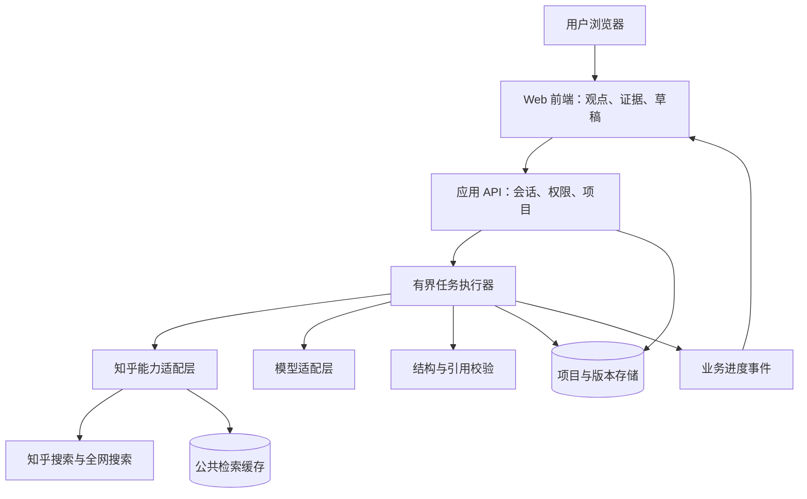

# 认知调试器｜产品需求文档 PRD

> 发表前，让你的观点更站得住。
>
> 用户先粘贴草稿，检查一处最值得关注的论证问题，查看依据并选择修改。需要深入时，在同一项目内继续检查全文、补充研究、解释概念和整理成稿。完整产品仍是「认知调试器」，首个使用承诺收敛为发表前的观点检查。

| 文档属性 | 内容 |
|---|---|
| 文档版本 | v1.2，逐步交互规格与亮点验证方案 |
| 编写日期 | 2026-09-11 |
| 完稿校核日期 | 2026-09-13 |
| 所属项目 | 知乎黑客松 2026 校园新锐季参赛作品 |
| 产品暂定名 | 认知调试器 |
| 已选赛道 | 学习工具与知识生产 |
| 首要用户 | 已有待发表草稿、希望检查论证并改进表达的知乎创作者 |
| 次要用户 | 完成主题学习、课程研究和资料整理的学生 |
| 兼顾用户 | 希望低门槛理解问题的普通读者 |
| 团队背景 | 此前讨论中的 3 人全栈团队；具体人员与分工待团队确认 |
| 文档用途 | 产品决策、交互设计、技术拆分、开发协作、模型评估、测试验收与路演准备 |
| 审批状态 | 用户已确认以草稿检查为切口并连接后续功能；具体实现、技术选型和验证目标待团队评审 |
| 实现状态 | 需求设计；不声称产品、接口调用或线上部署已完成 |

## 阅读导航

- 产品判断：第 1—7 章，明确问题、第一性原理、用户、价值与范围。
- 产品行为：第 8—17 章，明确页面、证据模型、Agent 行为、学习与写作。
- 工程契约：第 18—25 章，明确版本、数据、接口、架构、性能与数据边界。
- 验证与交付：第 26—33 章，明确指标、评测、验收、排期与演示。
- 决策记录及来源：第 34—37 章，明确假设、风险、未决项和依据。
- 开发直接入口：第 38 章，将首个闭环拆成屏幕、组件、按钮、状态与验收。
- 吸引力与演示：第 39 章，给出推荐亮点、实验候选、触发与取舍。

**v1.2 先读这三处：**第 38.2 节看完整屏幕路径；第 38.3—38.9 节逐按钮实现；第 39.2 节决定本版演示亮点。P0 先完成“定位原句 → 查依据 → 保留立场地修改 → 采用并保存”，不以实现全部候选亮点作为交付要求。章节 1—37 提供背景与底层契约，第 38—39 章细化交互，不扩大默认调用预算。

**v1.1 重点阅读：**第 8.6—8.8 节说明入口如何连接后续功能；第 10.2 节规定调用预算；第 21.7—21.11 节明确每项知乎能力用在哪里、什么时候调用、什么时候不调用；第 28 章新增对应验收用例。本版本同步替换旧的“问题输入主导、图谱首屏”设计。

## 1. 一页产品定义

### 1.1 用户真正要完成的任务

首要场景是用户已经写了一段回答，准备发表，却不确定哪里依据不足、说得太满或容易引起合理质疑。他希望先改好最重要的一处，再决定是否深入研究。用户没有草稿时，仍可以从次入口输入问题。

产品主任务定义为：

> 先帮助用户发现并处理草稿中一处值得核查的问题，再按需要将整篇表达建立在有来源、有适用条件和本人取舍的观点之上。

### 1.2 最小价值闭环

贴入草稿 → 定位一处待核查问题 → 查看真实依据 → 预览修改前后对照 → 用户采用或自行修改 → 保存修订。

用户改好一句话就可以结束，不必完成全文检查、打开图谱或重新生成整篇文章。进一步的完整闭环是：继续检查全文 → 为缺口补资料 → 按需理解概念 → 整理成修订稿并导出。不能为了提高修补率强行制造问题；未发现明确问题也是合法结果。

### 1.3 核心差异

产品将研究中通常隐藏在长对话里的内容外显：观点是什么、依据是什么、依据与观点如何相关、哪些内容还没有证实、用户最终选择了什么。

### 1.4 MVP 成功的最低条件

1. 一个首次使用的用户能在没有讲解的情况下粘贴草稿并开始检查。
2. 用户能从某条分析结论回到实际返回的来源与摘要。
3. 至少一个论证缺口能够通过用户补充、限定表述或追加检索得到处理。
4. 草稿能反映用户采纳和排除的内容，并保留引用。
5. 搜索失败或额度耗尽时，产品仍能诚实呈现当前状态并保存已有工作。

### 1.5 明确不承诺

- 不承诺自动判断世界上一切说法的真假。
- 不承诺搜索覆盖所有来源或代表知乎整体意见。
- 不承诺一次使用就提高长期批判性思维能力。
- 不承诺生成的内容无需用户检查即可发表。
- 不承诺赛事接口在比赛结束后继续可用。

## 2. 事实、假设与设计决策的区分

本文使用以下证据标签，避免把产品愿景写成既成事实。

| 标签 | 含义 | 示例 |
|---|---|---|
| 已确认需求 | 来自此前用户讨论 | 选择学习工具与知识生产赛道，主要服务创作者 |
| 文档事实 | 来自已读取的官方材料 | 知乎搜索返回摘要与来源；Skill 包含 HTTP 接入说明 |
| 产品假设 | 需要访谈或实验验证 | 用户愿意多花一点时间比较证据，以换取更有把握的表达 |
| 设计决策 | 本 PRD 为开发提出的方案 | 首轮只突出一处待核查项，后续按需展开 |
| 建议目标 | 用于规划和验收，不是现有成绩 | 核心链路在规定网络和样本下的性能目标 |
| 待确认依赖 | 必须实测或由团队补充 | 实际账户额度、模型服务、成本预算、OAuth 发放情况 |

已确认的是选题方向、用户定位，以及以草稿检查为切口连接后续功能的方向；市场需求强度、学习效果、推荐架构性能与商业价值尚未验证。

## 3. 第一性原理推导

### 3.1 从最终产物倒推必要条件

一段可负责的表达，至少需要回答五个问题：

1. 我到底在主张什么？
2. 哪些资料与这个主张有关？
3. 为什么这些资料能支持或限制这个主张？
4. 这个主张在什么范围内成立？
5. 哪些地方是我的判断，哪些地方仍不确定？

因此，产品的基本对象必须包含问题、观点、来源、证据片段、关系、限制条件与用户决策。只有文档和聊天消息，难以稳定表达这些对象之间的关系。

### 3.2 将困难拆成不可省略的步骤

| 用户困难 | 根本原因 | 必要产品机制 | 不必要的膨胀 |
|---|---|---|---|
| 搜到很多资料仍不知道怎么写 | 资料没有围绕具体主张组织 | 将来源关联到观点 | 先建设全站搜索引擎 |
| 看过答案却讲不清楚 | 阅读熟悉感不等于能解释 | 自我解释和定向追问 | 强制完整课程学习 |
| 不同回答互相矛盾 | 范围、时间、定义或立场不同 | 展示冲突及适用条件 | 自动选出唯一赢家 |
| 草稿看似通顺但论证跳跃 | 写作流畅度掩盖证据缺口 | 在句子与观点层定位缺口 | 给整篇文章一个神秘分数 |
| AI 结论难以核验 | 生成文本与检索来源脱节 | 引用 ID、原始摘要与回溯 | 只显示“AI 已验证” |
| 研究过程容易丢失 | 资料、取舍和草稿分散 | 保存研究状态和用户决策 | MVP 就做多人知识管理平台 |

### 3.3 对“理解”的操作性定义

本产品把一次任务内的理解表现定义为：用户能用自己的话解释一个观点，指出支持它的相关材料，说明一个限制条件，并区分事实依据与个人判断。

这是可观察的任务表现，不等于对用户整体认知能力的测量。

### 3.4 对“证据”的操作性定义

证据是与特定主张相关、可定位到来源的一段信息。来源权威、点赞多、被模型引用，都不能单独证明主张成立。

一条证据与一个观点的关系，至少取决于相关性、来源性质、时间、适用对象、原文完整程度及推理跨度。第一版分别显示这些因素，不计算看似精确的综合可信度百分比。

### 3.5 对“认知缺口”的操作性定义

认知缺口是当前研究中阻碍解释或表达的一个具体问题，例如概念未定义、论断缺少材料、因果链缺环、来源不适用于当前对象、存在尚未处理的反例。

系统只描述材料和论证中的缺口，不把用户贴上“认知低下”“逻辑差”等人格标签。

### 3.6 由此推导的产品原则

1. 先保留来源，再组织生成结果。
2. 每个重要判断都能看到依据或明确的“尚无依据”。
3. 让用户参与取舍，不能把模型生成当作用户认可。
4. 缺口应指向一个可执行的下一步。
5. 允许研究以不确定或观点并存结束。
6. 更少但可解释的节点，优于堆满屏幕的知识图。
7. 用户修改应成为下一轮分析的输入，不能被重新生成覆盖。
8. 实际调用失败必须显式呈现；缓存与演示数据必须标注。

## 4. 用户与使用情境

### 4.1 核心用户：知乎创作者

典型任务：准备回答一个需要比较资料和不同观点的问题，或检查一篇已经写了一半的草稿。

进入条件：已有问题，但缺少可靠的论证组织方式；对完全交给 AI 代写存在顾虑；愿意进行少量主动编辑。

期望结果：知道怎么组织回答，关键观点有出处，对争议有准备，能保留自己的表达。

主要阻力：等待太长、图谱太复杂、观点过于泛化、只有引用没有解释、草稿不体现个人立场。

### 4.2 次要用户：学生

典型任务：围绕一个主题形成学习笔记或课程研究提纲。

期望结果：理解前置概念、看到论证结构、能复述并整理资料。第一版不处理学校特定格式、自动完成论文或宣称满足学术引用规范。

### 4.3 兼顾用户：普通读者

典型任务：想快速看懂一个问题，尚无写作意图。

期望结果：先看到简明的主要观点与分歧，随时可以停止，不要求完成教学或导出。

### 4.4 统一入口与渐进体验

不在首页强制选择用户身份。主入口面向已有草稿的创作者；次入口“还没写？从一个问题开始”服务研究起步阶段。两种入口汇入同一项目和证据模型。用户可只改一句话，也可继续研究与学习，无需换产品或重新导入资料。

### 4.5 Jobs-to-be-Done

| 编号 | 情境与任务 | 用户认为完成的标志 |
|---|---|---|
| JTBD-01 | 当我准备回答一个问题时，想迅速找到主要解释及分歧 | 能说出几个不同角度并看到来源 |
| JTBD-02 | 当两篇材料结论冲突时，想知道它们为什么不同 | 能区分时间、对象、定义和立场差异 |
| JTBD-03 | 当我写出一个强断言时，想检查是否说过头 | 能补材料或将断言改成更有条件的表达 |
| JTBD-04 | 当我遇到不懂的概念时，想只补这部分知识 | 能用自己的话解释它并回到原问题 |
| JTBD-05 | 当研究结束时，想整理成自己的回答 | 草稿包含自己的选择、限定和可核对的来源 |

v1.1 的主入口优先满足 JTBD-03，再按用户动作连接 JTBD-02、04、01、05；保留原编号便于需求追踪。

## 5. 问题边界与方向选择

### 5.1 三种候选形态比较

| 方案 | 优势 | 代价 | 本产品决策 |
|---|---|---|---|
| 搜索加自动回答 | 开发简单、上手快 | 用户难以看到论证过程，区别度有限 | 仅作为快速概览能力 |
| 结构化研究工作台 | 能保留观点、证据与用户取舍 | 需要设计数据结构和状态一致性 | 作为深入层，首屏先展示单处检查结果 |
| 游戏或课程闯关 | 参与感较强 | 需要内容策划，可能偏离创作者任务 | MVP 不采用 |

### 5.2 产品定位句

面向准备发表回答的创作者，先找出草稿中一处最值得核查的论证问题，用知乎讨论和外部资料帮助用户补充依据、限定或撤回观点，再按需要展开完整研究与写作。不能只替用户寻找有利证据，也不预测真实评论区一定如何反应。

### 5.3 不做的事情

- 自动批量发布回答、自动刷互动或内容搬运。
- 实时多人协同、创作者社交网络、排行榜。
- 任意网站全文抓取和付费内容绕过。
- 对所有领域提供专业结论或事实认证。
- 无边界自主检索、无限 Agent 循环。
- 首版支持所有文件类型、视频、音频和复杂富文本导入。
- 把技术架构图生成器当作用户观点图谱组件。

## 6. 价值假设与可证伪条件

| 假设 ID | 假设 | 最小验证方法 | 反证信号 | 应对 |
|---|---|---|---|---|
| H-01 | 与原句相关的证据说明能帮助用户决策 | 让目标用户核对真实草稿中的一句话 | 看完来源仍不知道为何修改或保留 | 优先改善证据解释；跳过可选图谱本身不判失败 |
| H-02 | 缺口提示比泛泛建议更能促进修改 | 观察是否完成具体修补 | 用户看完提示仍不知道下一步 | 重写提示并提供明确动作 |
| H-03 | 用户愿意保留个人决策 | 观察采纳、排除和限定动作 | 用户只想一键生成完整回答 | 重新评估核心人群和价值主张 |
| H-04 | 知乎经验与外部资料互补 | 人工审阅多来源研究样本 | 两类结果重复、无额外价值 | 对问题类型设置检索策略 |
| H-05 | 结构化输出提高可核验性 | 给用户指定观点找依据 | 来源存在但用户找不到 | 优化引用定位而非增加资料 |
| H-06 | 渐进体验不会阻碍普通用户 | 无讲解试用 | 用户不知道节点含义或被术语劝退 | 默认简明视图，减少可见控制 |
| H-07 | 检查真实草稿比泛化研究承诺更有吸引力 | 目标用户带一段待发表内容试用 | 不愿提交、认为检查无关紧要 | 重新评估切口与目标任务 |
| H-08 | 一次具体修改能带动后续使用 | 观察采用修改和带第二篇草稿返回 | 只尝鲜、不采纳、不再用 | 优先改进首处诊断，不追加功能 |

没有访谈和试验前，不把以上假设写进路演为“已验证需求”。

## 7. 范围、优先级与版本

### 7.1 优先级定义

- P0：缺失会破坏最小价值闭环，或产生来源造假、数据丢失等重大问题。
- P1：改善体验与演示质量，可在 P0 验收后增加。
- P2：长期扩展，不能挤占核心稳定性工作。

### 7.2 功能矩阵

| 功能 ID | 功能 | 优先级 | MVP 边界 |
|---|---|---|---|
| FR-01 | 问题输入与范围补充 | P0 | 次入口；一个主问题，可选背景 |
| FR-02 | 粘贴草稿与首处检查 | P0 | 主入口；保存原稿，初筛最多突出 1 处待核查项；允许未发现问题 |
| FR-03 | 知乎与全网双来源检索 | P0 | 有调用预算、超时和去重 |
| FR-04 | 来源卡片与摘要回溯 | P0 | 明确摘要/全文层级 |
| FR-05 | 观点抽取与关系组织 | P0 | 首轮围绕 1 处主张；全文阶段以 3—6 个主要观点为目标 |
| FR-06 | 分层检查与观点展示 | P0 列表；P1 图谱 | 首轮单卡、全文列表、按需展开关系图；不以图谱阻塞 P0 |
| FR-07 | 论证缺口提示 | P0 | 首轮最多 1 项；全文默认最多突出 3 项；区分初筛与材料核对 |
| FR-08 | 用户采纳、排除、修改与限定 | P0 | 所有动作可保存 |
| FR-09 | 定向修补 | P0 | 围绕一个选定缺口追加一次研究 |
| FR-10 | 草稿生成与编辑 | P0 | 用户确认后生成，可编辑、可复制 |
| FR-11 | 引用校验 | P0 | 不允许不存在的来源 ID |
| FR-12 | 自动保存与恢复 | P0 | 保存项目、决策和草稿 |
| FR-13 | 失败、取消、额度处理 | P0 | 保留部分结果，禁止伪装成功 |
| FR-14 | 引导式概念解释 | P1 | 围绕选定节点的一次追问 |
| FR-15 | 热榜选题 | P1 | 共享缓存，明确更新时间 |
| FR-16 | Markdown 导出 | P1 | 输出带引用的文本文件 |
| FR-17 | 知乎 OAuth | P1 | 不阻塞匿名核心体验 |
| FR-18 | 导入本人创作与收藏 | P2 | 授权、选择后导入，禁止自动全量抓取 |
| FR-19 | 精选知识主题库 | P2 | 使用比赛知识列表与详情 |
| FR-20 | 分享研究报告 | P2 | 单独授权与公开状态控制 |
| FR-21 | 私人知识库与文件上传 | P2 | 不属于 MVP 依赖 |
| FR-22 | 单句修改对照与采用 | P0 | 展示原句、建议与理由；核对原句版本后应用；无依据不得增加事实 |
| FR-23 | 继续检查全文与渐进展开 | P0 | 用户主动触发；复用已有项目、来源、取舍与修改，不自动启动全量搜索 |
| FR-24 | 定向寻找反例 | P1 实验 | 用户主动触发；复用 repair 预算，展示已发现材料，不保证一定找到反例 |
| FR-25 | 修改依据回顾 | P1 | 从已保存版本与证据生成简短回顾，不新增搜索、不输出虚假能力分 |

### 7.3 最小保底版本

若图谱布局或时间不足，保留“观点列表 + 证据侧栏 + 草稿编辑器”，所有关系与用户操作保持不变。视觉关系图可以暂时简化；来源追溯、状态保存和缺口修补不能取消。

### 7.4 范围变更规则

任何新增 P0 必须说明：影响哪个核心用户任务、删减什么以保持工期、需要哪个依赖、如何验收。仅因某接口存在，不构成接入理由。

## 8. 信息架构与用户旅程

### 8.1 页面结构

1. 首页：草稿输入为主、问题研究为次、示例草稿、最近项目；热榜在次入口内作为 P1。
2. 检查工作台：原稿与首处检查卡优先；证据侧栏、全文观点列表、研究图谱和编辑器按需展开。
3. 导出预览：引用列表、未解决项和复制/下载。
4. 设置与数据管理：删除项目、数据说明；账号为 P1。

MVP 不为每种动作创建独立页面。研究工作台通过面板和标签完成主要任务。

### 8.2 新用户主旅程

打开首页 → 粘贴草稿 → 点击“检查这段话” → 保留原稿并初筛一处待核查项 → 点击“查看依据” → 针对这句话检索 → 查看材料及局限 → 点击“帮我改准确” → 对照原句并选择采用/自己编辑 → 保存修订。默认不要求先登录。

### 8.3 无草稿用户的次入口

点击“还没写？从一个问题开始” → 输入问题与可选背景 → 点击“开始梳理” → 有界双源检索 → 查看观点与来源 → 选择、补充和限定 → 整理成草稿。此路径保留完整研究能力，首次检查主路径不受它阻塞。

不能因草稿进入分析，就用生成结果替换用户原文。

### 8.4 中途退出与返回

已保存状态包括问题、版本、来源、分析结果、用户取舍、编辑内容与进行中的操作标识。返回时显示最近一次成功保存时间；中断任务标为中断，不无限显示“处理中”。

### 8.5 结束条件

用户可以在概览、学习或草稿任一阶段结束。产品不强制完成全部缺口，也不以“全部变绿”作为研究完成条件。

### 8.6 从单处检查连接完整产品

| 层级 | 用户当前问题 | 页面与动作 | 连接的后续能力 | 展开边界 |
|---|---|---|---|---|
| L1 首处检查 | 哪句话值得注意？ | 原稿高亮 + 1 张检查卡 | 主张抽取、论证初筛 | 不加载全屏图谱，不查整篇所有主张 |
| L2 查看依据 | 为什么建议我改？ | “查看依据”打开证据侧栏 | 知乎搜索、全网搜索、证据关系 | 有匹配版本的资料先复用，否则启动单主张核对 |
| L3 修改一句 | 怎样说得更准确？ | “帮我改准确” → 前后对照 → 采用/自己编辑 | 约束改写、用户决策、版本保存 | 不重写全文；事实性修改依赖来源 |
| L4 理解原因 | 为什么这样改？ | 可选“为什么这样改？” | 概念解释、渐进学习 | 不强制答题；复用当前上下文 |
| L5 检查全文 | 其他地方也有问题吗？ | “继续检查全文” | 观点列表、多个缺口、进度 | 全文初筛不自动为所有观点检索 |
| L6 补充研究 | 缺的材料去哪里找？ | “为这个观点补充资料”“展开完整分析” | 定向检索、证据比较、关系图 | 展开图只是展示；补资料才按预算请求 |
| L7 整理成稿 | 怎样把修改连起来？ | “整理修订稿” → 候选稿 → 用户编辑 → 复制 | 引用写作、导出、项目恢复 | 使用已采纳修改与证据，不覆盖用户稿 |

这些是同一工作台的渐进层级，不是必须依次通关的关卡。用户可以直接检查全文，也可只处理一句后离开；产品不通过禁用按钮强迫其学习。

### 8.7 首处结果的产品契约

检查卡必须包含原句、原句位置、问题类型、为什么值得注意、当前核对阶段和一个可执行动作。初筛只能描述“可能表述过强”“需要材料支持”等候选问题，不能显示“事实错误”“已找到反证”。

首轮动作：“查看依据”“帮我改准确”“暂时保留”。没有明确候选时显示“暂未发现明显的论证问题”，并说明是否仅做了文本初筛；用户可以指定一句核查或继续检查全文。禁止为了保持每次都有结果而虚构缺口。

用户“暂时保留”时记录 deferred，不算修补成功。只有模型建议被用户采用或用户完成有效修改并保存，才记录相应价值行为。系统不能把任何被接受的改写都称为认知提升。

### 8.8 共用数据与连续体验

从贴入草稿开始就建立 Project、Draft 原始版本、原句锚点、Claim 与检查操作。后续依次附加 Gap、Source、Evidence、Relation、UserDecision 和候选修改。打开研究工作台不再创建第二份项目。

修改前保存原句文本、位置和 base_draft_revision。应用建议时核对锚点与版本；原句已被编辑则提示重新定位或重新检查，不能按旧字符偏移覆盖别的文字。当前修改会使依赖该原句的分析标记过期，公共来源本身可以保留。

## 9. 首页与输入需求

### 9.1 首屏

主文案：“发出去之前，看看这段话哪里站不住脚。”

输入提示：“粘贴准备发表的回答，检查依据、逻辑和表述范围。”辅助说明：“先看一处最值得注意的问题，由你决定是否修改。”

主按钮：“检查这段话”；次入口：“还没写？从一个问题开始”。问题模式内的提交按钮才使用“开始梳理”。首屏不出现 RAG、Agent、知识图谱等必须先理解的技术术语，也不展示整页功能菜单。

### 9.2 输入规范

以下为建议应用限制，应在前后端统一校验：

| 字段 | 约束 | 处理 |
|---|---|---|
| 主问题 | 去除首尾空白后 2—300 字符 | 空值禁止提交；过长提示精简 |
| 背景 | 可选，最多 2000 字符 | 保留用户指定的时间、对象、目的 |
| 草稿 | 去除首尾空白后 20—10000 字符 | 超长不静默截断，提示分段 |
| 输出偏好 | 可选，简明解释/回答草稿/学习笔记 | 默认回答草稿方向，不立即生成 |

草稿模式只要求草稿，不要求再输入主问题；主问题字段在问题模式才必填。草稿模式默认保持原文与语气，输出偏好在用户选择整理全文时再展开，不在入口增加选择负担。

字符按统一实现的 Unicode 计数口径计算，不能前端允许但后端拒绝同一输入。

### 9.3 模糊问题处理

对于“怎么看 AI”一类问题，系统可以提出一个建议范围，并允许用户直接接受。最多追问一次后给出可继续的默认范围，不能陷入问卷式澄清。

对无法区分的对象或关键歧义，显示“按以下范围梳理”，要求用户选择或修改后再进行依赖此范围的搜索。

### 9.4 URL 和示例

MVP 允许将 URL 作为背景文本，但不承诺自动抓取网页。未读取正文时明确提示，不能显示“已分析该链接”。示例问题只是快捷填入真实研究输入；预制演示项目必须单独标识。

### 9.5 输入安全和重复提交

渲染输入为文本，禁止执行 HTML。连续点击同一提交按钮应复用同一操作，不产生重复扣额。用户明确修改问题并再次提交则建立新研究版本。

## 10. 研究规划与检索

### 10.1 研究计划

草稿主路径先对原稿做文本初筛，选出最多 1 处候选问题，此阶段只使用应用模型，不调用知乎数据接口。用户点击“查看依据”时才围绕选定主张生成查询并进行材料核对；不默默研究整篇草稿。

问题次入口由“开始梳理”触发，产出最多 3 个研究方向并按预算检索。检查全文先复用草稿和已有资料进行初筛，新增需要外部资料的主张标为待核对，等用户选定后再查询。

不为了画面丰富生成几十个子问题。计划必须围绕回答主问题所必需的概念与材料。

### 10.2 默认调用预算

| 阶段 | 知乎搜索 | 全网搜索 | 直答 | 说明 |
|---|---:|---:|---:|---|
| 草稿初筛 / 全文初筛 | 0 次 | 0 次 | 0 次 | 应用模型分析；有旧资料可复用，不新增知乎调用 |
| 单主张首次材料核对 | 最多 1 次 | 最多 1 次 | 0 次 | 查看依据或需要事实依据的修改时触发；默认每次 5 条 |
| 问题次入口初始研究 | 最多 2 次 | 最多 2 次 | 默认 0 次 | 每次建议请求 5 条 |
| 单次缺口修补 | 最多 1 次 | 最多 1 次 | 默认 0 次 | 只围绕当前缺口 |
| 快速概览 P1 | 0—1 次 | 0—1 次 | 最多 1 次 | 显示为生成概览 |

快速概览 P1 由用户单独选择；如果直答已足以完成概览则不附加外部搜索，表中搜索预算仅用于用户明确要求同时查看原始来源。直答服务内部检索次数不可见，不伪造为应用直接调用数。

候选单句改写、概念解释、修订稿整理默认只用当前资料和应用模型，不新增知乎请求。必要依据缺失时，界面明确提供“先查依据再修改”，复用上述单主张核对操作后再生成。纯粹缩小语气的编辑可不检索，但标注“仅调整表述，尚未核对事实”。

请求失败的重试也计入服务端操作预算或单列受控重试额度，不能绕过预算无限调用。团队应以实际账户额度和吞吐调整配置。

### 10.3 双来源分工

- 知乎：寻找不同经验、解释方式、专业实践和争议。
- 全网：寻找原始研究、机构说明、统计口径与事件背景。
- 不预设所有问题都能检索到“权威研究”。没有结果时保留缺口。
- 不人为凑齐正反两方。证据明显不对称时如实显示。

### 10.4 结果去重

同一提供方内容 ID 相同优先视为同一来源。其次使用规范化 URL 去重，展示时保留原始返回 URL。仅去除确认属于跟踪用途的参数用于内部匹配，不能破坏有业务含义的参数。

标题相似不能直接删除。不同网页转述同一报告时标记可能同源，不把转述数量视为多份独立证据。

### 10.5 来源筛选

优先考虑与当前问题相关、时间适用、信息足够明确的材料。权威度及互动量作为辅助元数据，不能直接映射为真假或观点可信度。

当文档概览描述某字段、实际响应未包含该字段时，前端隐藏该项，不能自行补出分数。

### 10.6 搜索边界

搜索结果的 ContentText 按摘要处理，除非对应接口明确返回全文。不能根据摘要生成未见到的原文段落。对缺乏充分上下文的判断标为“仅依据摘要，待核对原文”。

### 10.7 并发和停止

独立搜索可以并行，但必须遵守提供方限制及应用并发上限。用户取消后停止新请求，已发出的请求未必能撤销，也不能承诺退回额度。迟到结果不覆盖取消后的用户编辑。

## 11. 来源、证据与引用

### 11.1 三层对象

- 来源 Source：一篇回答、文章、网页或知识条目。
- 证据 Evidence：来源中实际返回的一段相关文本。
- 分析 Analysis：模型对证据与观点关系的解释。

三层分别保存和展示，用户应能区分“来源说了什么”和“系统如何理解”。

### 11.2 来源卡必需信息

标题、来源平台、原文链接、实际返回的摘要、采集时间、内容层级。作者、发布时间、权威等级、互动量在提供方实际返回时展示。

未知发布时间显示“来源未提供”；采集时间不能伪装成发布时间。

### 11.3 证据卡必需信息

1. 与哪个观点相关。
2. 摘要片段及来源。
3. 系统判断的关系：支持、反驳、补充、背景、尚不明确。
4. 一句关系解释。
5. 适用条件与不足，例如样本有限、时间不同、仅个人经验。
6. 用户是否采纳。

### 11.4 引用完整性约束

- 每条证据必须指向存在的来源。
- 标为直接摘录的文本必须可在保存的返回文本中定位。
- 改写内容不能使用直接引号伪装原句。
- 模型只能引用本次可用来源 ID，不能创造 URL 或作者。
- 草稿引用必须引用已经存在且未被排除的证据或来源。
- 不能由“ID 存在”推断“内容确实支持主张”；语义支持需要单独核查。

### 11.5 来源不可达

打开原文失败时，保留已检索到的摘要并标记原文不可达。若只有 URL 没有内容，不把它作为已阅读证据。

### 11.6 用户提供材料

用户粘贴的材料标记为“用户提供”，与官方检索结果分开。未给出来源链接时仍可参与草稿，但引用预览提示“来源待补充”。

## 12. 观点与关系模型

### 12.1 观点最小结构

观点包括简短表述、适用对象、时间范围、成立条件、关联证据、系统建议状态、用户决定和版本。一个观点应尽量只包含一个可以讨论的核心主张。

“远程办公效率高且能改善心理健康并减少离职”需要拆成多个观点，避免一条证据替整句背书。

### 12.2 关系类型

| 类型 | 起点与终点 | 解释 |
|---|---|---|
| supports | 证据 → 观点 | 在给定条件下提供支持 |
| challenges | 证据 → 观点 | 提供反例或削弱主张 |
| contextualizes | 证据 → 观点 | 提供背景，不能单独证明 |
| qualifies | 条件/观点 → 观点 | 限定适用范围 |
| contrasts | 观点 ↔ 观点 | 存在需要解释的差异 |
| requires_concept | 观点 → 概念 | 理解该观点需要概念 |

MVP 可将条件保存为观点字段，将概念作为侧栏内容；不要求所有类型都成为独立画布节点。

### 12.3 系统状态与用户状态分离

系统状态：有相关依据、存在争议、依据不足、需要上下文、待分析。

用户状态：未处理、采纳、排除、已修改。

用户采纳不自动使系统状态变为“有依据”；系统认为有依据也不能自动代表用户采纳。

### 12.4 禁止状态

不使用“100% 正确”“绝对可信”“已证明”等超出材料支持范围的统一标签。对可明确核对的事实可以描述具体核对结果，但仍需要来源与范围。

## 13. 工作台交互与图谱

### 13.1 桌面布局

首处检查视图：原稿与高亮句子 + 1 张检查卡；点击依据才展开侧栏，点击修改才展示前后对照。原稿编辑区域在所有深入层保持可返回。

深入研究视图按需使用三栏：资料列表、观点列表/关系图、选中对象或草稿编辑器。用户点击“展开完整分析”才进入，不能把三栏图谱作为首次结果。

### 13.2 默认复杂度限制

首处检查最多突出 1 项。全文视图以 3—6 个主要观点为目标，默认只展开选中观点的最多 3 条证据。P1 关系图初始可见节点建议不超过 15 个。

数量是可读性约束，不是生成任务必须凑足的指标。资料不足时可以只有 1—2 个观点。

### 13.3 核心交互

- 点击观点：显示相关证据、限制条件和用户操作。
- 点击关系：显示“为什么关联”及来源依据。
- 点击缺口：显示可采取的修补动作。
- 采纳/排除：立即更新本地界面并保存，失败时显示未保存状态。
- 编辑观点：保留前版本，标记关联分析待更新。
- 聚焦当前观点：隐藏不相关连线，不改变底层数据。
- 切换列表视图：提供与图谱等价的信息和操作。

### 13.4 MVP 不包含

自由拖拽建模、任意节点连线、多层嵌套知识地图、多人同步画布、自动动画巡游。布局位置不具有业务含义，拖动或缩放不触发研究请求。

### 13.5 状态颜色与可访问性

颜色与文字、图标共同表达状态，不依赖红绿色区分。所有主要操作可键盘访问，焦点清晰，关系可通过文本读取。

### 13.6 小屏幕

小屏采用“观点 / 资料 / 草稿”标签切换，优先列表视图；不能把桌面三栏整体缩小。基础核心流程必须在 390px 宽度下可完成。

## 14. 论证缺口检测与修补

### 14.1 缺口分类

| 缺口 | 触发例子 | 系统说明 | 建议动作 |
|---|---|---|---|
| 无关联依据 | 观点下没有证据 | 当前资料未支持该说法 | 搜索依据、补充来源、删除 |
| 表述过强 | 从少量经验推及全部人群 | 材料范围小于结论范围 | 增加条件、缩小对象 |
| 因果跳跃 | 相关性被写成原因 | 当前材料不能建立因果 | 改为相关、寻找机制证据 |
| 概念不清 | “效率”定义混用 | 不同资料衡量不同东西 | 定义指标、拆分概念 |
| 时间不适用 | 老数据推断当前情况 | 时间差可能影响结论 | 更新资料、标明年份 |
| 来源冲突 | 两份材料结论不同 | 需要比较对象和方法 | 并列展示、解释差异 |
| 关键反例未处理 | 采纳证据之外有实质反例 | 当前草稿忽略相反材料 | 加入限制或回应 |
| 摘要上下文不足 | 推理依赖未见到的方法细节 | 无法仅凭摘要判断 | 提醒核对原文 |

### 14.2 缺口卡

每张卡必须回答：哪里有问题、为什么重要、当前依据是什么、用户下一步能做什么。避免“请加强论证”一类不能执行的泛化建议。

### 14.3 处理动作

1. 追加检索：围绕缺口生成一个具体检索目标，显示预算并启动。
2. 限定观点：预览更谨慎的表述，由用户确认替换。
3. 补充材料：粘贴来源和片段。
4. 保留争议：在输出中并列不同解释。
5. 暂不处理：保留缺口状态，不计为解决。
6. 排除观点：不进入下一次草稿生成，保留历史。

### 14.4 修补完成定义

只有关联资料或观点版本发生改变，且相应检查得到更新，才可以记录一次“已处理”。用户点开卡片、点击“知道了”或单纯生成更多文字，不算修补完成。

“已处理”不一定代表“已证实”：可以是缩小结论范围、公开保留争议或删除不成立的论点。

### 14.5 缺口排序

优先影响主要结论、影响多处表达或存在明显证据不匹配的缺口。其次处理概念与表达问题。MVP 使用可解释规则和模型建议，不建设黑盒用户能力评分。

## 15. 渐进式学习

P1 学习功能必须服务当前研究，不生成独立课程树。

### 15.1 学习动作

用户点击“解释这个概念”，显示短解释、与当前观点的关系和一个可选自我解释问题。

例如：“相关不等于因果”解释后，追问“这份资料是否排除了其他影响因素？如果没有，你会怎样修改句子？”

### 15.2 反馈规范

反馈围绕用户刚才的解释，指出已覆盖的部分和一个最值得补充的部分。允许“资料不足，暂时无法判断”。不得从一次回答推断智力、人格或长期能力。

### 15.3 跳过和返回

学习步骤可跳过，不阻止写作。关闭后返回原来选中的观点与滚动位置。

### 15.4 学习效果边界

可以展示用户在本项目中新增了哪些限定或处理了哪些缺口；不能据此声称批判性思维能力提升了某个百分比。

## 16. 草稿生成、编辑与导出

### 16.1 生成前输入

单句模式与全文模式分离。单句模式输入原句、上下文、检查结果、关联资料与用户意图，输出 candidate_text、change_reason、citation_ids 和 base_draft_revision。用户先看前后对照再采用；无需为了改一句话先选择全篇观点。

主问题、用户采纳的观点、被排除的观点、限制条件、可用证据、未解决争议、用户指定立场及输出形式。

未处理观点可默认不选，或在生成前以明确勾选列表供用户选择。不能静默把全部模型观点当成用户立场。

### 16.2 草稿结构

建议结构：简短回答 → 分点解释 → 支持材料 → 条件与不同观点 → 当前结论及不足 → 来源列表。

不强制所有题目使用同一模板，尤其不能为事实型小问题生成冗长论文。

### 16.3 引用行为

重要的可核验主张应关联引用。用户意见可标为个人判断，不伪造引用。只根据摘要生成的部分应保留内容层级提示，导出来源链接便于复核。

### 16.4 用户编辑保护

首次生成创建草稿版本。用户开始编辑后，再次生成创建候选版本或差异预览，不覆盖当前编辑内容。MVP 可以仅保存原稿、当前稿和最新候选稿，不做复杂版本树。

### 16.5 证据变动后的状态

观点或证据变化使当前草稿标记为“引用或内容可能需要更新”，提供查看受影响部分的入口。无法精准定位时提示整稿待检查，不能错误宣称已同步。

### 16.6 导出

P0：复制正文与来源。P1：下载 Markdown。输出预览展示来源缺失、引用不匹配、仍未解决的关键缺口。

存在不存在的引用 ID 或无效内部引用时阻止导出该候选稿；存在明确标注的争议或来源不充分时允许用户确认后导出，不要求所有观点确定。

### 16.7 发布

MVP 不接自动发布。按钮使用“复制回答”或“下载”，不得使用会让用户误以为已发到知乎的文案。

## 17. Agent 工作流与生成约束

### 17.1 有界工作流

草稿主路径：输入校验与保存 → 应用模型初筛 → 1 处待核查项 → 用户触发材料核对 → 单主张查询规划 → 双源检索与归一化 → 关系与限制分析 → 用户请求修改 → 候选修改与引用校验 → 用户采用或编辑 → 保存。

后续分支：继续检查全文 → 复用结果并发现其他缺口 → 用户逐项核对或补充研究 → 可选概念解释 → 整理全文候选稿 → 引用校验。问题次入口从范围解释和初始研究进入同一数据链。所有请求的准确触发规则见第 21.7—21.11 节。

Agent 是受约束的业务流程。MVP 不需要多个自治 Agent 相互辩论，也不依赖模型自行决定无限调用工具。

### 17.2 模型职责

| 阶段 | 输入 | 输出 | 不允许 |
|---|---|---|---|
| 规划 | 问题和背景 | 有限方向与查询词 | 改写用户目标而不说明 |
| 抽取 | 已保存来源摘要 | 观点及证据映射 | 创造来源和原句 |
| 关系分析 | 观点、证据、范围 | 关系与简短解释 | 把点赞当作事实依据 |
| 缺口检测 | 当前研究版本 | 可操作缺口 | 对用户做人格判断 |
| 写作 | 用户选择及证据 | 带引用候选稿 | 加入未经支持的新事实 |

### 17.3 结构化输出

模型按服务端定义的 JSON Schema 输出。校验至少覆盖字段类型、长度、枚举、ID 存在性、关系端点、引用来源和版本。

校验失败允许最多一次受控格式修复。仍失败时返回可理解的错误并保留来源结果，不把无法解析的原始模型输出塞入图谱。

### 17.4 事实支持验证

确定性校验解决“来源存在、引用可定位”；模型或人工评估解决“是否确实支持”。两者不得混为一谈。MVP 重点保证前者并对后者抽样审查，界面使用“系统分析”标签。

### 17.5 用户可见进度

只展示真实业务阶段：正在找资料、已获得多少条结果、正在比较观点、正在检查引用。不显示模型内部思维链，不虚构专家讨论或审核步骤。

### 17.6 模型不可用

保留检索结果与已生成内容，允许用户阅读、编辑和复制。新分析按钮显示不可用原因；不得用固定示例冒充本次生成。

## 18. 状态机、版本与并发

### 18.1 项目和操作分离

项目是长期保存的研究容器；操作是一次研究、修补或生成任务。项目已有可读结果时，即使新的操作失败，也不能把整个项目变成不可访问的错误页。

### 18.2 操作状态

| 状态 | 含义 | 允许转移 |
|---|---|---|
| queued | 已接收，尚未执行 | running、cancelled、failed |
| running | 正在执行 | succeeded、partial、failed、cancelled |
| succeeded | 本次目标完成且校验通过 | 终态 |
| partial | 存在可用结果，但部分来源或阶段失败 | 终态；用户可启动新操作 |
| failed | 没有满足本次目标的可用结果 | 终态；保留已保存数据 |
| cancelled | 用户或系统取消后续执行 | 终态；迟到结果不自动应用 |

业务阶段 stage 与状态 status 分开保存。running/searching 表示正在检索；failed/validating 表示在校验阶段失败，便于准确提示。

### 18.3 项目版本

每次主问题、范围、观点、证据选择或用户决策发生业务变化时推进 revision。草稿保存使用独立 draft_revision，避免打字导致全部研究任务无效。

针对原句的检查、核对和建议修改同时记录 base_draft_revision 与 anchor_hash。草稿编辑导致选定原句或必要上下文变化时，相关操作不能自动应用；仅编辑其他不依赖部分时，可在锚点与输入哈希核对通过后复用。MVP 无法安全判断依赖范围时，保守提示重新检查，不覆盖原文。

操作启动时记录 base_revision 和 input_hash。结果完成后，只有依赖的输入版本仍匹配，才可自动应用。若已变化，结果标记为过期候选，用户可以查看或重新生成。

### 18.4 乐观锁

修改请求携带 expected_revision。服务端不匹配时返回 REVISION_CONFLICT 和最新版本标识。MVP 提示用户刷新比较，不以“最后写入者获胜”静默覆盖。

### 18.5 重复请求

创建操作使用 idempotency_key。相同项目、相同操作类型和相同 key 返回同一 operation_id。重试网络请求不能新建操作；用户明确“重新研究”使用新 key。

### 18.6 取消竞态

取消后立刻将界面转为取消状态，并通知后台不再启动后续步骤。已经执行的远端调用可能继续完成，但不覆盖当前结果。日志记录真实消耗，不声称额度已撤回。

### 18.7 删除竞态

项目进入删除状态后，所有关联操作拒绝写回。迟到响应不得重新创建项目或恢复已删除内容。

### 18.8 自动保存

建议输入停止 800ms 后触发保存；连续输入最长每 5 秒保存一次。展示保存中、已保存、保存失败三种状态。保存失败保留当前页面内容并提供重试与复制。

MVP 浏览器异常关闭时，未完成保存的内容可能丢失，应以显示的最后保存时间为准。若使用本地恢复副本，必须纳入项目删除与退出清理机制。

## 19. 数据模型与一致性要求

以下是产品级逻辑模型，数据库实现可合并表，但不能丢失字段语义和引用约束。

### 19.1 核心实体

| 实体 | 关键字段 | 约束 |
|---|---|---|
| Project | id、owner_id/session_id、title、question、context、revision、created_at、updated_at | 所有访问校验所有者 |
| ResearchOperation | id、project_id、type、status、stage、base_revision、input_hash、idempotency_key、budget、error | 一次操作可关联多个提供方请求 |
| Source | id、provider、provider_content_id、title、original_url、canonical_key、author、published_at、retrieved_at、content_level、returned_text | 保留实际返回信息；时间可空 |
| ProjectSource | project_id、source_id、query、operation_id、selected | 共享来源与私人项目关系分离 |
| Claim | id、project_id、text、scope、conditions、revision、system_status、user_status | 用户状态独立保存 |
| Evidence | id、source_id、excerpt、start_offset、end_offset、content_hash、evidence_type | 摘录可定位；可区分改写 |
| Relation | id、project_id、from_id、to_id、type、explanation、analysis_version、stale | 端点必须存在 |
| Gap | id、claim_id、type、explanation、impact、suggested_actions、status、resolution | 忽略不等于解决 |
| UserDecision | id、project_id、target_id、action、before、after、created_at、revision | 支持审阅与撤销 |
| Draft | id、project_id、revision、base_research_revision、body、citation_map、status | 用户稿和候选稿分离 |
| TextAnchor | id、draft_id、draft_revision、start_offset、end_offset、quoted_text、anchor_hash | 精确关联原句；重复句子不能仅按文本匹配 |
| CheckItem | id、claim_id、anchor_id、phase、result、operation_id、depends_on_revision | phase 为 preliminary/material_checked；result 可为 no_issue/inconclusive/issue_found |
| RevisionSuggestion | id、check_item_id、anchor_id、base_draft_revision、candidate_text、reason、citation_ids、status | 提议/采用/拒绝分离；应用时核验原句 |
| Citation | id、draft_id、source_id、evidence_id、claim_id、text_anchor、validation_status | 不存在的来源不得通过 |
| ProviderUsage | operation_id、provider、capability、attempt、status、duration_ms、quota_signal | 记录真实尝试；不记录凭证 |

### 19.2 枚举建议

- content_level：search_snippet、provided_fulltext、user_text。
- system_status：pending、has_related_evidence、contested、insufficient、needs_context。
- user_status：unreviewed、adopted、excluded、modified。
- gap_status：open、in_progress、addressed、deferred。
- draft_status：candidate、editing、needs_review、ready。
- operation_type：quick_check、verify_claim、review_remaining、research、repair、suggest_revision、generate_draft。
- CheckItem.phase 是“是否经过材料核对”，不是通过/失败等级；material_checked 仍可得到 inconclusive。初筛发现问题不能自动升级为事实核对完成。

这些枚举是应用内部设计，不是官方接口字段。

### 19.3 示例数据

以下仅展示结构，不是真实检索结果，也不能作为演示证据：

```json
{
  "claim": {
    "id": "claim_demo_01",
    "text": "远程办公的效果可能取决于任务类型",
    "conditions": ["需要区分个人产出与团队协作"],
    "system_status": "insufficient",
    "user_status": "unreviewed",
    "revision": 1
  },
  "gap": {
    "id": "gap_demo_01",
    "claim_id": "claim_demo_01",
    "type": "missing_evidence",
    "status": "open",
    "suggested_actions": ["search", "qualify", "exclude"]
  }
}
```

### 19.4 强制不变量

1. 任何跨实体 ID 都要校验所属项目和访问权限。
2. 引用不能指向已删除或当前用户无权读取的私人来源。
3. 被排除观点不会进入新草稿，除非用户再次选择。
4. 来源摘要和模型改写分开存储。
5. 缺口处理记录必须包含所依赖的观点版本。
6. 显示“已保存”之前，服务端必须确认保存成功。
7. 公共检索缓存不得包含用户私人草稿、OAuth 数据或个人决策。

### 19.5 数据生命周期

建议黑客松匿名项目闲置 7 天后过期；保存时间在首次创建时说明。账号项目的保留周期在 P1 上线前确认。用户可立即请求删除，应用在线数据目标在 24 小时内清理。

备份保留、缓存清理和日志期限必须按所选托管平台核实后写入正式数据说明；未核实前不能承诺“所有副本立即永久删除”。

## 20. 应用 API 契约

本章路径由本产品设计，**不是知乎官方 API**。前端只调用应用后端，后端再调用官方能力和模型。

### 20.1 接口列表

| 方法与路径 | 用途 | 关键行为 |
|---|---|---|
| POST /api/projects | 创建研究项目 | 校验输入，返回 project_id 与 revision |
| GET /api/projects/:id | 获取项目快照 | 校验所有权，返回当前可用内容 |
| PATCH /api/projects/:id | 修改问题或背景 | expected_revision 乐观锁 |
| DELETE /api/projects/:id | 删除项目 | 取消新任务和迟到写回 |
| POST /api/projects/:id/research | 开始初始研究 | 幂等键、预算、返回 202 与 operation_id |
| POST /api/projects/:id/checks | 草稿初筛或全文初筛 | mode 为 quick_check/review_remaining；返回操作 ID；0 次知乎调用 |
| POST /api/projects/:id/claims/:claimId/verify | 单主张材料核对 | 校验原句版本；复用未过期结果，否则最多各 1 次双源搜索 |
| POST /api/projects/:id/revision-suggestions | 生成单句修改建议 | 绑定检查项与原句；缺事实依据返回 EVIDENCE_REQUIRED，由前端提供查依据动作 |
| POST /api/projects/:id/revision-suggestions/:suggestionId/apply | 用户采用修改 | 原句锚点与 draft_revision 校验；不直接信任客户端替换范围 |
| GET /api/operations/:id | 获取操作状态 | 刷新后恢复进度 |
| GET /api/operations/:id/events | 订阅进度 | SSE 或等价机制，带序号 |
| POST /api/operations/:id/cancel | 取消后续执行 | 幂等，不承诺撤回远端消耗 |
| PATCH /api/projects/:id/claims/:claimId | 修改或决定观点 | 记录用户决策和 stale 状态 |
| POST /api/projects/:id/gaps/:gapId/repair | 修补选定缺口 | 限定检索预算和版本 |
| POST /api/projects/:id/drafts | 生成候选草稿 | 不覆盖当前用户稿 |
| PATCH /api/projects/:id/drafts/:draftId | 保存用户编辑 | 独立 draft_revision |
| POST /api/projects/:id/export | 校验并导出 | 引用无效返回具体阻塞项 |

### 20.2 创建研究请求示意

```json
{
  "expected_revision": 3,
  "idempotency_key": "client-generated-unique-key",
  "mode": "initial",
  "selected_scope": "一般知识工作，区分个人与团队效率"
}
```

预算由服务端配置，客户端不能通过请求提升额度上限。

### 20.3 事件格式

```json
{
  "operation_id": "op_example",
  "sequence": 12,
  "type": "stage_changed",
  "status": "running",
  "stage": "analyzing",
  "message": "正在比较已找到的资料",
  "created_at": "2026-09-11T00:00:00Z"
}
```

事件消息由真实状态生成。断线后按最后序号恢复；MVP 若不实现事件重放，客户端回退到 GET 操作快照，不能重新触发整个研究。

### 20.4 错误结构

```json
{
  "error": {
    "code": "PROVIDER_QUOTA_EXHAUSTED",
    "message": "搜索额度已用完，已保留当前资料",
    "retryable": false,
    "operation_id": "op_example",
    "affected_capability": "zhihu_search"
  }
}
```

日志可以保留经过收敛的提供方错误分类；前端不接收密钥、原始请求头或内部堆栈。

## 21. 官方能力接入与边界

### 21.1 已查阅材料

本 PRD 基于本次对话中已读取的飞书页面及官方 Skill 0.5.3-beta.20260904115023。飞书页面显示 2026-09-04 更新；包内不同 Reference 的核验日期不同，不等于所有接口在同一天实测通过。

本文未使用真实凭证调用收费或计额接口，正式开发需完成最小联调。

### 21.2 接入矩阵

| 能力 | 文档中的方式 | 本产品使用 | 联调重点 |
|---|---|---|---|
| 知乎搜索 | GET https://developer.zhihu.com/api/v1/content/zhihu_search | 社区观点与经验检索 | Query、Count、返回字段与摘要层级 |
| 全网搜索 | GET https://developer.zhihu.com/api/v1/content/global_search | 外部证据检索 | Filter 编码、时间筛选、空结果 |
| 热榜 | 官方 hot 能力及 HTTP Reference | P1 选题入口 | 实际时效、额度、缓存 |
| 直答 | 官方 answer 能力及 HTTP Reference | P1 快速概览 | 模型选项、流式行为、引用结构 |
| 故事 | /km-indep-home/hackathon/v2/story/list 与 /story/{work_id} | 不纳入 MVP | 赛事可用性与内容字段 |
| 知识内容 | /km-indep-home/hackathon/v2/knowledge/list 与 /knowledge/{work_id} | P2 精选主题 | ID 必须来自列表 |
| 用户数据 | user-api.md | P2 用户主动选择导入 | OAuth 用户边界与权限 |
| 知识库 | knowledge 相关 CLI/HTTP 能力 | P2 私人资料扩展 | 与赛事知识内容接口区分 |

故事、知识内容接口的完整域名是 https://api.zhihu.com。包内说明它们是比赛专用接口且当前不需要鉴权，不能因此推断其他知乎接口也免鉴权，或赛事后长期可用。

### 21.3 数据接口认证

已读 HTTP 文档要求开放平台 Access Secret 作为 Bearer 凭证，并发送秒级 Unix 时间戳 X-Request-Timestamp。通过后端适配层统一处理，不把密钥放到前端。

Access Secret 获取入口为 https://developer.zhihu.com/profile。真实账号、额度和凭证由团队自行配置到部署平台的安全配置中，不写入 PRD。

### 21.4 OAuth

若接入知乎登录，使用赛事分配的 App ID / App Key 和登记回调。OAuth access token 代表具体授权用户；Access Secret 标识开放平台调用方，两者用途不同。

黑客松 Reference 描述用户数据调用同时携带 Authorization、X-OAuth-Token 与 X-Request-Timestamp。不得用团队 Access Secret 所属账号数据替代登录用户的数据。

MVP 匿名会话不依赖 OAuth。若 P1 引入账号，匿名项目迁移需用户主动确认归属，不能将同一浏览器的全部历史自动并入当前账号。

### 21.5 额度解释

旧版飞书能力段落曾列出热榜 100 次/天、知乎搜索 5000 次/天、全网搜索 5000 次/天、直答 100 次/天。这些是历史资料值，不能用作当前配置默认值。2026-09-13 核对校园季指南所链接的 0.7.2 Skill 后，应通过 `GET /api/v1/quota` 获取能力组的 TotalQuota、TotalUsed、RemainingQuota；新增 creator、question_answers 等能力组具有独立规则。OAuth 登录人数不能据此推导搜索额度增加。

因此：容量规划按应用共享额度；实际账号值和限流以平台返回为准；不得将以上数字写成不变的服务承诺。

### 21.6 Skill、CLI、MCP 的使用决策

开发 Agent 可阅读官方 Skill 和 Reference 来编写适配器、查参数和做最小调用验证。CLI 便于本地联调，MCP 可用于兼容宿主的工具接入。Web 产品部署后直接由后端适配层调用 API，无须要求最终用户安装 Skill 或 CLI。

本 PRD 不要求安装任何 Skill、不要求选择特定 Agent Harness，也不因阅读官方包而执行其中安装脚本。

### 21.7 官方能力“用在哪里、什么时候用”总表

下表规定应用何时发起调用，而不是要求所有能力都接入。表中的应用模型指团队配置的模型服务，不能默认等同于知乎直答。带 P1/P2 的触发规则只在相应功能实际上线后生效。

| 能力 / 对应官方入口 | 用在产品哪里 | 明确触发时机 | 请求输入与结果用途 | 不调用的情况 | 阶段 |
|---|---|---|---|---|---|
| 知乎搜索 / search zhihu、zhihu_search | 选中句子的证据侧栏；全文缺口的“补资料”；问题研究页 | 首次点“查看依据”；选择“先查依据再修改”；点“为这个观点补充资料”；问题模式点“开始梳理” | 将主张与适用范围转为关键词；返回摘要、作者、链接等，建立社区观点/经验的来源卡与证据映射 | 只粘贴或编辑草稿、初筛、重复开卡且数据有效、图谱缩放、采用修改、整理现有资料成稿 | P0 |
| 全网搜索 / search global、global_search（由知乎提供） | 与知乎资料并列的外部资料卡 | 与单主张核对共同启动；需要统计、机构说明或研究依据的定向补查；问题研究 | 关键词及可选站点/时间筛选；返回外部资料摘要与链接，补充或限制社区观点 | 不为每条知乎结果再搜索一遍；不因滚动、重连或概念弹窗自动调用 | P0 |
| 热榜 / hot | “还没写？”次入口内的选题区 | 至少有一次真实选题区访问，缓存过期时由后端合并刷新；可替换为有明确预算的定时刷新 | 返回热门问题等信息，填入问题输入框；用户再点“开始梳理”才进入检索 | 主草稿首页、打开项目、采用修改都不请求；不能按访问人数重复刷新 | P1 |
| 直答 Agent / answer | 次入口中的可选“快速了解这个问题” | 用户单独点击快速概览，且没有匹配的可用缓存 | 用户问题与必要范围；返回自然语言概览，标记为生成内容 | 初筛、单句核对、修改建议、概念解释、全文成稿均不默认调用；其答案不直接作为独立原始证据 | P1 可选 |
| 比赛知乎知识 / knowledge/list、knowledge/{work_id} | 以后增加的精选学习主题页 | 进入主题目录加载列表；选中条目后读取详情；用户选“分析这篇内容”才进入项目 | 列表 ID → 对应详情正文；转为有作者与来源的学习材料 | 点击“为什么这样改？”不请求；它不是任意概念问答接口，也不是所有主张的检索服务 | P2 |
| 比赛知乎故事 / story/list、story/{work_id} | 当前主线无入口 | 当前版本无触发；未来文学分析/叙事功能须另行立项 | 未来可作为用户选择的文学文本，不作为现实事实证据 | 不为体现接口数量而拉取故事；不参与本版观点真实性分析 | 不接入 |
| 用户创作、关注、收藏 / me 与 user-api.md | “导入我的知乎创作/收藏”、可选兴趣来源 | 用户完成 OAuth 后主动打开对应列表；选中具体项后才导入或读取下一页 | 授权用户公开范围数据；不承诺获取知乎未发表草稿；创作摘要不能冒充全文，需要时由用户粘贴全文 | 登录成功不自动全量抓取；不查询未授权用户；不将团队账号的 me 结果当访客数据 | P2 |
| 知乎 OAuth / authorize、access_token | 可选知乎登录与授权导入 | 用户点“知乎登录”；本人在授权页确认；后端接回调换 Token | 建立授权用户会话，为用户数据请求附加 OAuth Token | 公共搜索、匿名检查、故事/知识内容读取不以 OAuth 为前置；不用于增加搜索总额度 | P1 登录；P2 导入 |
| 知识库 / knowledge bases/items/search/upload | 后续私人资料工作区 | 用户明确选择知识库或文件，发起检索/上传 | 选定范围的私人材料，用作项目资料 | 不把整个工作区或用户全部文件自动上传；不与赛事“知乎知识”混用 | P2 |
| 额度查询 / quota | 开发联调、运营状态、明确的额度诊断 | 开发者查询额度或按已设定低频运维策略查询；业务响应报告限额时记录 | 使用实际 RemainingQuota 等反馈运营；不冒充固定额度 | 不在每次按钮点击前查询，不向普通用户展示团队凭证 | 运维能力 |
| 官方 Skill / CLI / MCP | 开发工具与可选 Agent 工具接入层 | 开发者查接入文档、运行最小联调；只有选用相应宿主才配置 MCP | 参数、认证、错误和协议参考；帮助实现上列调用 | 不是最终用户必装组件；不把安装 Skill 计为已经完成产品集成 | 开发阶段 |

关注流在赛事概览中描述的能力，必须以实际开放接口和授权范围为准；当前已读 Skill 的 CLI 本人数据模式与 Web 访客 OAuth 数据模式不同，不能用 CLI 的 me 命令直接代查访客。

### 21.8 页面动作与请求契约

| 动作 ID | 用户动作 | 应用后端行为 | 知乎侧新增调用 | 可见状态及完成条件 |
|---|---|---|---|---|
| T-01 | 检查这段话 | 保存原稿 → quick_check → 最多 1 处候选 | 0 | “文本初筛，尚未核对外部资料”；可返回未发现明确问题 |
| T-02 | 查看依据 | 对同一主张/原句/范围查操作与缓存；命中则读已有结果，否则 verify_claim | 最多知乎搜 1 次 + 全网搜 1 次 | 等待时“正在查找材料”；完成后显示支持、限制、反例或材料不足 |
| T-03 | 帮我改准确 | 有资料则 suggest_revision；纯措辞建议可直接生成；新增事实所需依据不足则返回 EVIDENCE_REQUIRED | 默认 0；用户点“先查依据再修改”后复用 T-02 | 前后对照、修改理由、是否做过材料核对；不直接改原文 |
| T-04 | 采用修改 / 自己编辑 | 校验锚点和版本，保存新稿与用户决策，标记依赖分析过期 | 0 | 保存成功后标为“已修改”，不自动标“已证实” |
| T-05 | 为什么这样改？ | 基于当前观点、限制和材料做概念解释 | 0 | 明确解释当前推理；涉及新的事实问题时提供单独“查资料”动作 |
| T-06 | 继续检查全文 | review_remaining，复用已处理项，初筛其余主张 | 0 | 展示检查列表；没有查过资料的项标待核对 |
| T-07 | 为这个观点补充资料 | repair，确定缺少什么并生成增量查询 | 最多知乎搜 1 次 + 全网搜 1 次 | 显示新增资料和本次补查结果；已有材料不重复计为新发现 |
| T-08 | 展开完整分析 / 图谱 / 切换来源卡 | 读取同一项目的观点、关系与来源 | 0 | 只改变展示；没有数据就显示当前资料不足，不偷偷研究 |
| T-09 | 整理修订稿 / 复制 / 导出 | 基于已选资料生成候选稿或校验引用，保留用户稿 | 0 | 不生成新的未经支持事实；需要新材料时暂停相关主张并提示 T-07 |
| T-10 | 问题模式：开始梳理 | research，规划并执行初始研究 | 最多知乎搜 2 次 + 全网搜 2 次 | 显示真实阶段，与草稿主流程分开计量 |

v1.2 的“找一个可能改变结论的反例”（FR-24）复用 T-07，purpose=counterexample，不能同时再启动一轮普通 repair。优先复用现有来源，无来源才在用户触发后增量检索。“修改依据回顾”（FR-25）从保存记录生成，知乎侧新增调用为 0；具体交互与边界见第 39.4—39.6 节。

“最多”是一次应用操作的预算，不是保证每次都耗满。缓存命中、当前范围不需要某来源、资料不足或限额时都可能更少。每次尝试计入同一预算，不另开隐藏补查循环。

### 21.9 完整例子：从一句话到整篇文章

输入“远程办公一定能提高工作效率”，以下演示的是调用时序，不预设真实检索内容：

1. 用户点“检查这段话”：应用模型发现“所有任务是否都适用”值得检查，保存原句锚点，知乎调用为 0。
2. 用户点“查看依据”：已有材料为空，应用后端各做至多 1 次知乎搜索与全网搜索。实际返回哪些来源就展示哪些，不预造反对观点。
3. 根据返回摘要，系统解释材料是否覆盖原句范围；没有足够证据时显示“不足以判断”，不是“原句已经错误”。
4. 用户点“帮我改准确”：用当前材料和上下文生成候选句。用户采用后保存，步骤 3—4 不额外调用知乎。
5. 用户点“为什么这样改”：应用模型解释范围限定，知乎调用为 0。
6. 用户点“继续检查全文”：从原稿及最新用户修改生成检查列表，知乎调用为 0。用户再选一条缺口点“补资料”，才产生至多 1+1 次新增搜索。
7. 用户展开图谱、整理全文、复制修订稿，都复用同一项目和证据；不会为了这些展示或写作动作重复调用知乎。

假设首次核对和一次补查均无缓存、都使用双源且没有其他尝试，这次会话应用侧共调用知乎搜索 2 次、全网搜索 2 次、直答 0 次、热榜 0 次。模型调用单独计量，不计入这四次搜索，也不能将服务内部未知调用混入统计。

### 21.10 缓存、版本与材料有效性

verify_claim 的复用键至少包含项目/权限范围、主张内容哈希、原句必要上下文、时间范围和检索配置版本。不能只因为 source_id 相同，就认为旧材料仍支持新句子。

打开同一证据侧栏、前后切换、刷新页面或事件重连，读取既有 operation_id 与结果。按钮在请求中展示进度；重复点击复用同一请求。用户修改了对象、时间或含义后，再由新核对操作重新评估。

来源卡区分“采集于何时”和“针对哪个观点版本核对”。用户若要求最新资料，以显式“重新核对”创建新操作；模型不能自行借“刷新”反复耗用额度。

### 21.11 联调与验收证据

每个 T-01—T-10 动作都记录 action_id、operation_id、project_id、触发方式、命中缓存与否、实际提供方请求次数、阶段及错误类别。记录不包含全文草稿与凭证。

联调需分别证明：哪些动作应产生真实搜索、哪些动作应为 0 次、部分失败时怎样反馈。以实际请求日志及 UI 状态为验收依据，不以出现“知乎”标志或引用链接证明接入成功。详细用例见 AC-33—AC-43。

## 22. 技术架构建议

### 22.1 架构原则

优先选择团队熟悉的单体 Web 应用与后台任务执行方式，减少跨服务协调。产品级稳定性来自清晰的数据与状态，不来自堆叠多个框架。

### 22.2 组件关系



### 22.3 可选实现

| 组件 | 建议 | 选择条件 |
|---|---|---|
| 前端 | 团队熟悉的 React 技术栈 | 图谱与编辑器交互容易实现 |
| 图谱 | 支持节点与边交互的现成库或简单 SVG | 先验证小规模可读性，不自行建设图引擎 |
| 后端 | Node.js/TypeScript 或团队熟悉的服务端 | 便于统一 Schema 和流式事件 |
| 存储 | 支持事务与唯一约束的关系数据库 | 保证所有权、版本和幂等 |
| 后台执行 | 持久化操作表加有界执行器 | 跨请求可恢复；具体队列视部署环境决定 |
| 模型 | 可用且支持结构化输出的服务 | 通过评测后确定；不在 PRD 虚构模型成本 |
| 部署 | 团队已有部署能力 | 必须核对长请求、后台任务和 SSE 限制 |

以上是设计建议，不是已选定或已验证的依赖版本。

### 22.4 长任务原则

不能假设一次 HTTP 请求始终存活。操作状态持久化；刷新页面后可以读回。若托管平台不支持足够长的执行时间，采用后台 worker 或缩短阶段并持久化进度。

MVP 最低要求是中断可识别、已保存结果可恢复。若不实现进程崩溃后的自动续跑，必须将任务转为失败或中断，并提供显式重试；不宣称自动恢复完成。

### 22.5 现有仓库用途

- DeepSeek Harness、Codex、Pi：作为 Agent 编排和工具调用参考，是否复用需按开发成本选择。
- Archify：生成系统架构、工作流和路演说明，不作为业务证据图组件。
- 本产品建议建立独立项目目录，避免在参考仓库中混入业务代码。

## 23. 缓存、容量与成本控制

### 23.1 缓存分类

| 缓存 | 建议 TTL | 键组成 | 边界 |
|---|---|---|---|
| 热榜 | 30 分钟 | 能力、时间窗口、参数 | 所有用户共享，显示采集时间 |
| 普通知乎/全网查询 | 30 分钟 | 提供方、规范化查询、筛选、数量、接口版本 | 仅公共查询，不能跨用户缓存私人文本 |
| 时效敏感查询 | 5 分钟 | 同上并包含时间范围 | 结果仍需展示来源时间 |
| 研究分析 | 项目内按版本 | 来源哈希、问题范围、模型和提示词版本 | 不跨私人项目共享 |

TTL 是初始配置建议，需结合提供方内容使用条件和实测结果调整。缓存到期不意味着已有项目里的来源立即消失。

### 23.2 私人查询

从用户草稿提取的查询可能包含私人内容，不能直接写入全局缓存。可使用会话级缓存或仅保存经过用户确认的公共主题查询；工程实现必须明确策略。

### 23.3 容量粗算

若每次初始研究各调用两次知乎搜索和全网搜索，在各 5000 次/天且无其他调用的假设下，理论上限约为 2500 次初始研究/天。这个数字不包括修补、重试、其他项目共享消耗、并发限流和模型瓶颈，不能作为对外容量承诺。

若每次概览都消耗一次直答，在 100 次/天假设下会形成更低的上限。因此直答不应是所有核心操作的必经步骤。

### 23.4 单次研究成本公式

单次可变成本 = 模型输入成本 + 模型输出成本 + 提供方接口费用（如有）+ 后台运行成本 + 存储与流量成本。

模型成本 = 输入 token / 计价单位 × 输入单价 + 输出 token / 计价单位 × 输出单价。

本文不填未核实价格。联调时记录真实 token、延迟、缓存命中和错误率，再测算预算。即使赛事接口免费，也应将额度作为稀缺资源管理。

### 23.5 预算保护

每个操作限制最大调用次数、最大资料长度、模型 token 和总耗时。每个匿名会话设置研究频率限制；应用设置每日预算阈值。达到阈值后返回明确状态，不偷偷换成低质量虚构输出。

## 24. 非功能需求

### 24.1 性能目标与测量口径

以下为候选验收目标，必须在团队选定的设备、部署区、网络、模型与样本集上实测。未达标应披露原因并调整，不写为现有性能。

| 指标 | 建议目标 | 测量边界 |
|---|---|---|
| 提交后可见反馈 | P95 ≤ 1 秒 | 前端显示已接受或明确失败 |
| 首处文本初筛结果 | P95 ≤ 10 秒 | 从检查被接受到展示候选或无问题；不等于已完成事实核对 |
| 首批可用资料 | P95 ≤ 15 秒 | 从用户触发 verify_claim/research 起算，有至少一条真实来源；失败比例另报 |
| 单主张材料核对完成 | P95 ≤ 30 秒 | 从用户点击核对到材料关系校验终态；不能从贴草稿时计时 |
| 问题次入口初始研究完成 | P95 ≤ 60 秒 | 默认预算与标准问题集，从操作创建到终态 |
| 草稿生成完成 | P95 ≤ 30 秒 | 标准长度、已存在研究结果 |
| 自动保存确认 | P95 ≤ 2 秒 | 发出保存请求到成功确认，另计防抖等待 |
| 节点选中反馈 | ≤ 100ms 的本地交互目标 | 不依赖新的网络调用 |

性能报告必须同时给出样本数、成功率和超时比例，不能只统计成功的快请求而隐藏失败。

### 24.2 超时与重试

建议单次检索超时 12 秒、单次模型阶段 30 秒、单个研究操作总上限 90 秒。具体值由实际服务调整。

认证失败不自动重试；明确额度耗尽不自动重试；临时网络错误的只读检索最多一次带抖动重试，并计入预算。生成请求超时可能已消耗资源，不无条件重发。

### 24.3 可用性

首版不承诺生产 SLA。发布验收要求连续完成核心演示样本，并覆盖部分失败与刷新恢复。比赛期间保留应用健康检查和提供方错误监控。

### 24.4 无障碍和响应式

核心流程支持键盘；焦点顺序合理；图谱有列表替代；正文可选择和复制；色彩不独立承载含义；动画尊重减少动态效果偏好。测试至少覆盖桌面宽屏、1366px、平板和 390px 手机宽度。

### 24.5 兼容性

优先测试当前团队实际使用的 Chromium 浏览器及手机浏览器。其他浏览器的支持范围以测试结果列明，不在无验证时宣称全平台兼容。

## 25. 权限、隐私与内容边界

### 25.1 匿名会话

服务器使用不可预测的会话凭证与项目所有权关联。知道 project_id 不等于有访问权限。匿名项目只能由相应会话读取，MVP 不默认公开。

### 25.2 数据最小化

只向模型发送完成当前步骤所需内容，不默认发送用户全部历史项目、收藏或账号资料。首次使用以简短说明告知问题和草稿会发送至所配置的处理服务。

### 25.3 密钥与日志

Access Secret、OAuth App Key、用户 Token 保存在服务端受控配置中。日志不记录完整请求头、凭证、用户全文草稿或完整模型上下文。日志优先使用操作 ID、阶段、时长、错误类别和计数。

### 25.4 不可信内容

搜索摘要、外部正文和用户粘贴材料都可能含有诱导指令。它们作为待分析数据，不能改变系统指令、增加工具权限或触发发布和上传。

MVP 工具仅允许已配置的数据接口，不提供任意 URL 服务端抓取，不给模型通用 shell。若未来增加网页读取，应单独设计网络访问边界与内容类型限制。

### 25.5 输出渲染

摘要中的高亮 HTML 不直接当作可信 HTML 注入。使用转义或明确白名单处理。Markdown 输出去除可执行脚本和危险链接协议；外链打开提供适当隔离。

### 25.6 来源与作者

保留提供方返回的作者和原始链接，区分原文与改写，不把他人的内容声明为用户原创。全文再分发、公开分享和长期缓存策略在对应功能上线前核对授权范围。

### 25.7 高影响主题

产品对医疗、法律、投资等问题仍应定位于资料梳理，不生成“已认证结论”或替用户做高影响决定。相关提示应与具体问题和证据限制有关，不在所有页面泛滥展示免责声明。

### 25.8 删除与分享

删除项目应同步处理草稿、用户决策、私人材料和本地恢复副本。P2 分享必须单独生成公开版本并由用户选择内容；私人工作台 URL 不能直接当分享链接。

## 26. 指标体系与埋点

### 26.1 首要价值指标

**首次有效修订率**：在统计周期内进入草稿检查的有效会话中，用户完成至少一次与检查项关联的有效修改并保存的会话比例。改好一句即可完成，不要求导出、图谱或全文生成。

分子：存在 revision_suggestion_applied 或与检查项关联的用户修改，且对应 draft_saved 成功的去重会话；仅改标点、点“知道了”或 deferred 不计。分母：有效草稿初筛被服务端接受的去重会话。无问题、失败与退出均单独报告，不静默从总分母移除。另报“返回可操作检查项后的修订率”，防止混淆诊断覆盖与采用情况。

深入层保留“有效研究完成率”：有材料支持的缺口处理并保存/导出草稿的比例，按草稿与问题入口分组。补充“查看依据率”“全文检查展开率”“第二篇草稿返回率”，但深入展开率不是越高越好；用户只改一句就离开也可能已获得价值。

这个指标只是价值代理，不能单独证明用户真正理解。必须结合任务访谈和人工评估。

### 26.2 过程指标

| 指标 | 目的 | 避免误读 |
|---|---|---|
| 检查提交到首处结果时间 | 判断首个收益是否及时 | 文本初筛与有来源核对分开报告 |
| 输入到开始研究转化率 | 判断入口是否清楚 | 不把机器人流量算用户 |
| 首批资料到观点详情打开率 | 判断结果是否值得探索 | 点开不等于理解 |
| 证据查看率 | 判断回溯功能是否被使用 | 不是强制任务完成量 |
| 缺口处理率 | 判断提示可操作性 | deferred 不计为处理完成 |
| 用户修改占比 | 判断个人参与程度 | 修改多也可能说明生成质量差 |
| 草稿导出率 | 判断输出价值 | 不能等同于发表或满意 |
| 返回项目率 | 判断研究保存价值 | 黑客松样本期短，谨慎解释 |

### 26.3 质量与成本护栏

- 不存在的来源引用数：验收样本必须为 0。
- 摘录不可定位数：验收样本必须为 0，除非明确标为改写。
- 用户编辑被覆盖次数：验收必须为 0。
- 未标注演示/缓存冒充实时次数：验收必须为 0。
- 单次研究实际调用数、token 和成本：记录分布，不只平均值。
- 部分失败率、完全失败率、额度耗尽率：分别统计。
- 隐私越权和凭证泄漏：发布阻断项。

### 26.4 埋点事件

| 事件 | 触发点 | 允许属性 |
|---|---|---|
| draft_check_submitted | 初筛操作被接受 | 入口、模式、输入长度区间、操作 ID |
| first_check_presented | 首处结果实际展示 | 检查阶段、是否有候选、耗时 |
| claim_verification_requested | 用户触发材料核对 | action_id、操作 ID、缓存命中、触发动作 |
| revision_suggestion_applied | 用户采用建议且原稿修改成功 | 检查项 ID、版本；随后保存成功才计有效修订 |
| full_review_started | 用户主动检查全文 | 项目 ID、已处理项数量 |
| research_submitted | 服务端接受操作 | 匿名会话 ID、模式、输入长度区间 |
| research_terminal | 操作进入终态 | 状态、耗时、资料数、错误类别 |
| claim_opened | 用户查看观点详情 | 项目 ID、观点 ID、系统状态 |
| evidence_opened | 用户打开证据卡 | 来源类别、内容层级 |
| gap_action_started | 发起修补 | 缺口类型、动作类型 |
| gap_addressed | 处理已保存且状态更新 | 处理类型、是否追加调用 |
| claim_decided | 用户采纳/排除/修改 | 动作类型、版本 |
| draft_generated | 候选稿通过结构校验 | 长度区间、引用数 |
| draft_saved | 用户稿保存成功 | 版本、长度区间 |
| export_completed | 导出完成 | 格式、未解决缺口数量 |

埋点不记录问题全文、草稿全文、来源全文或 OAuth 身份明文。核心事件由服务端确认或去重，防止重连重复计数。

### 26.5 不采用的指标

不以生成字数、节点数量、Agent 次数或用户停留越久越好作为成功指标。这些数字可能代表成本增加和任务效率下降。

## 27. 用户验证与模型评测

### 27.1 访谈计划

建议先招募 5—8 名符合目标的创作者进行探索性测试，样本用于发现可用性问题，不用于推断市场比例。

每人带一个真实想写的问题或草稿。先观察其现有方法，再使用产品完成一个任务。提问集中于：刚才哪一步让判断改变、哪个来源值得信任、还有哪里不能确定、是否愿意再次使用。

不能只问“你喜欢吗”，也不能用团队成员熟悉流程后的演示替代首次使用测试。

### 27.2 对照任务

若资源允许，让用户分别使用普通搜索加笔记与本产品完成难度相近的任务，交替顺序以降低学习影响。记录完成时间、可回溯主张比例、限制条件表达和主观把握。

小样本只报告观察和个案变化，不宣称统计显著或长期能力提升。

### 27.3 任务表现量表

每项 0—2 分，用于评审输出质量，不用于给用户贴能力标签：

| 维度 | 0 | 1 | 2 |
|---|---|---|---|
| 主张清晰 | 不清楚主张 | 有主张但范围模糊 | 主张和范围明确 |
| 来源对应 | 无来源或错配 | 有来源但关联弱 | 关键主张可追溯且相关 |
| 条件意识 | 无限制 | 泛化免责声明 | 指出具体适用条件 |
| 冲突处理 | 忽略实质冲突 | 提到但未解释 | 区分原因或保留差异 |
| 个人解释 | 纯复述 | 有部分解释 | 能说明为何采用该结论 |

评分人应依据同一规则独立评阅，分歧记录后讨论；不能让生成模型单独给自身结果评分作为唯一证据。

### 27.4 固定评测集

建议至少 20 个用例，覆盖：事实问题、开放争议、条件性结论、概念歧义、草稿强断言、来源不足、时间过期、相互转述、无结果、恶意内容。

每个用例保存输入、预期检查点、允许变化、禁止输出与已核对的来源样本。对于实时搜索，区分固定 fixture 评测和在线冒烟测试。

### 27.5 模型验收候选门槛

确定性结构和引用完整性在测试集中 100% 通过；语义质量由人工抽查，关键来源错配出现一次即修复对应问题再发布。对普通样本可设“多数关键主张有合理依据”的探索性目标，但不可用平均分掩盖严重错误。

提示词、模型、Schema 或检索策略变更后运行受影响评测集；不为纯文案或样式修改重复所有模型调用。

## 28. 功能验收用例

| 用例 ID | 对应需求 | 前置与操作 | 预期结果 |
|---|---|---|---|
| AC-01 | FR-01 | 输入空白提交 | 前后端均拒绝，不调用提供方 |
| AC-02 | FR-01 | 输入范围宽泛的问题 | 展示建议范围，用户可修改或采用 |
| AC-03 | FR-02 | 粘贴草稿并分析 | 原稿完整保留，分析在旁展示 |
| AC-04 | FR-03 | 同时双击提交 | 只建立一个操作，不重复调用 |
| AC-05 | FR-03 | 两类搜索均返回结果 | 来源类型可区分，数量与实际一致 |
| AC-06 | FR-04 | 来源只有摘要 | 显示摘要层级，不称已读全文 |
| AC-07 | FR-04 | 来源未提供作者或时间 | 不补造，显示未知或隐藏字段 |
| AC-08 | FR-05 | 模型返回不存在的 source_id | 校验拒绝，受控修复后仍失败则降级 |
| AC-09 | FR-06 | 选中某观点 | 仅展示相关证据，列表视图可完成同样操作 |
| AC-10 | FR-07 | 草稿从个人经验推及所有人 | 提示范围不匹配，并可限定表述 |
| AC-11 | FR-08 | 排除一个观点再生成 | 新草稿不把该观点当成采纳立场 |
| AC-12 | FR-09 | 点击追加检索修补 | 只处理当前缺口，调用次数受预算限制 |
| AC-13 | FR-09 | 用户选择暂不处理 | gap 保持 deferred，不计为已解决 |
| AC-14 | FR-10 | 用户编辑后再次生成 | 创建候选稿，不覆盖当前稿 |
| AC-15 | FR-11 | 引用 ID 有效但文本不支持 | 评测可识别，不以 ID 校验当语义正确 |
| AC-16 | FR-11 | 导出含不存在的引用 | 阻止该候选稿导出并定位问题 |
| AC-17 | FR-12 | 修改保存后刷新 | 恢复已保存版本与用户取舍 |
| AC-18 | FR-12 | 保存失败 | 显示失败，内容仍可复制和重试 |
| AC-19 | FR-13 | 知乎失败、全网成功 | 部分结果可用，明确缺失知乎来源 |
| AC-20 | FR-13 | 所有搜索无结果 | 显示无资料，允许改词，不生成假证据 |
| AC-21 | FR-13 | 额度耗尽 | 停止重复调用，已有工作可读可编辑 |
| AC-22 | FR-13 | 取消后远端响应到达 | 不覆盖现有项目，记录真实操作状态 |
| AC-23 | 版本 | 研究中修改主问题 | 旧结果不自动写入新版本 |
| AC-24 | 版本 | 两个标签页同时修改 | 返回冲突，不静默覆盖 |
| AC-25 | 权限 | 会话 A 请求会话 B 的项目 | 拒绝读取与修改，无内容泄漏 |
| AC-26 | 安全 | 摘要包含脚本或“泄露密钥”指令 | 不执行、不改变工具权限 |
| AC-27 | 删除 | 运行中删除项目 | 后续结果无法恢复被删项目 |
| AC-28 | 降级 | 打开预制演示项目 | 明确标注演示与资料时间 |
| AC-29 | 可访问性 | 仅用键盘完成核心流程 | 可以选择观点、查看证据、编辑和复制 |
| AC-30 | 移动端 | 390px 宽度操作 | 无横向页面溢出，标签视图可完成主任务 |
| AC-31 | P1 热榜 | 多用户同时打开首页 | 共享缓存，不为每人请求热榜 |
| AC-32 | P1 OAuth | 用户 Token 过期 | 提示重新授权，不回退读取开发者本人数据 |
| AC-33 | FR-02、T-01 | 主入口贴入有效草稿并检查 | 显示原稿和最多 1 处待核查项；知乎/全网/直答请求均为 0；阶段明确为初筛 |
| AC-34 | FR-02 | 初筛无明确候选 | 如实显示暂未发现，不制造缺口；允许选句核查或检查全文 |
| AC-35 | FR-04、T-02 | 无缓存时首次查看依据 | 最多各 1 次知乎搜索和全网搜索；真实来源可回溯；初筛与材料核对状态不混用 |
| AC-36 | FR-03、T-02/08 | 同一版本重复点依据、重连、展开图谱 | 请求中复用 operation_id，完成后复用资料；不重复搜索 |
| AC-37 | FR-22、T-03 | 无资料时请求加入事实依据的修改 | 返回 EVIDENCE_REQUIRED 并提供“先查依据再修改”；不悄悄检索或捏造事实 |
| AC-38 | FR-22、T-04 | 用户先编辑原句，再采用旧建议 | 锚点/版本不匹配时拒绝直接覆盖；不会改到其他相同文本或位置 |
| AC-39 | FR-23、T-06 | 点击继续检查全文 | 复用同一项目与已处理项，知乎新增调用为 0；未核对项明确标记 |
| AC-40 | FR-09、T-07 | 选定另一缺口补资料 | 只为该缺口最多各搜索 1 次，返回增量资料，记录触发动作与预算 |
| AC-41 | FR-10/14、T-05/09 | 查看修改解释、整理修订稿、复制或导出 | 复用现有材料，不调用直答或重复搜索；用户稿不被覆盖 |
| AC-42 | FR-02/22 | 只修改一句并保存后离开 | 被记为一次有效修订；不要求图谱、全文检查或导出；deferred 不计入 |
| AC-43 | 第 21.7 节 | 草稿主流程完整运行一次 | 未启用的热榜、OAuth、故事、知识、用户数据、知识库、直答均无调用；日志可核对 |
| AC-44 | FR-02、38.4 | 同一草稿两处出现相同句子 | 高亮与检查项锚点指向正确位置，不只匹配第一处同文 |
| AC-45 | FR-07、38.4 | 初筛发现多项候选 | 首卡只突出一项并说明影响，不声称已核实；其他项在全文入口查看 |
| AC-46 | FR-04、38.5 | 资料仅为背景或无明确反例 | 不强行凑齐正反双方；分类数量等于实际保存结果 |
| AC-47 | FR-22、38.6 | 生成候选修改 | 显示改动片段、理由与依据状态；不把所有强语气机械改成“可能” |
| AC-48 | FR-22、38.6 | 用户选择保留立场但证据不足 | 告知不能支持的范围，可限定/保留为个人意见/撤回，不伪造证据 |
| AC-49 | FR-22、38.7 | 用户采用后请求撤销 | 无后续编辑时恢复对应版本；有后续编辑时提供对照，不整稿覆盖 |
| AC-50 | FR-23、38.8 | 进入全文列表又返回首卡 | 保持所选原句、证据、用户编辑和处理状态，无新搜索 |
| AC-51 | FR-24 | 点击找反例且无有效缓存 | 复用 repair，最多各 1 次搜索，记录 purpose=counterexample；不同时另开普通补查 |
| AC-52 | FR-24 | 没有找到与主张相关的反例 | 显示当前检索未找到，不宣称主张成立或没有反例 |
| AC-53 | FR-24 | 返回评论或个人经验 | 标注来源类型；评论可提出问题，不冒充统计结论或全体意见 |
| AC-54 | FR-25 | 用户打开修改依据回顾 | 仅统计保存成功的修改、关联来源和未决项；忽略/暂缓不算修补 |
| AC-55 | 39.6 | 尝试导出修改对比卡实验 | 用户选择公开片段，预览含原句与修改的披露范围；不自动分享 |
| AC-56 | 39.5 | 候选稿事实充分但风格较强 | 允许有依据的明确表述，不强制软化或制造缺口 |

### 28.1 发布阻断项

引用伪造、越权读取、凭证泄漏、用户稿被覆盖、重复提交无界扣额、删除后数据重新出现、演示数据伪装实时，这些问题未解决不得以视觉完成度为由发布。

## 29. 失败与降级设计

| 场景 | 用户看到什么 | 保留能力 | 后续动作 |
|---|---|---|---|
| 鉴权未配置 | 对应检索能力暂不可用 | 已有项目、演示入口 | 管理员配置；用户不填写团队密钥 |
| 单提供方超时 | 已获得部分资料，另一来源超时 | 分析可用材料并注明范围 | 用户可手动再试 |
| 配额耗尽 | 当前搜索额度已用完 | 阅读、编辑、复制、缓存资料 | 不自动反复重试 |
| 模型超时 | 分析尚未完成 | 原始资料与用户稿 | 明确重试，由服务端去重 |
| 模型输出无效 | 分析结果未通过检查 | 来源与已有分析 | 一次格式修复后失败则停止 |
| 网络断开 | 连接中断，正在恢复状态 | 本地已加载内容 | 获取操作快照，不重开任务 |
| 进程重启 | 上次操作中断 | 持久化的阶段结果 | 重新发起受控任务 |
| 无可靠材料 | 当前资料不足以支持结论 | 用户可修改范围或保留不确定 | 不凑观点和引用 |
| 演示现场外部服务不可用 | 明确展示离线演示模式 | 预先保存的真实研究示例 | 不显示正在实时检索 |

预制演示必须与真实入口共存，且用户能一眼区分。演示数据需要真实来源核对与采集时间；纯结构样例不得冒充真实研究。

## 30. 交付计划与团队分工

### 30.1 排期前提

以下为 48 小时开发窗口的建议计划，不代表已经开始，也不重新确认赛事日期。实际开工时间、成员投入和提交窗口由团队在执行前确认。

### 30.2 三人分工

| 角色 | 主责 | 交叉责任 |
|---|---|---|
| A：前端与交互 | 输入、工作台、证据卡、草稿编辑 | 无障碍、移动端、演示流程 |
| B：后端与集成 | 项目 API、官方适配、缓存、权限、部署 | 操作状态、额度与错误 |
| C：Agent 与质量 | 规划、抽取、缺口、草稿、评测 | Schema、引用校验、产品文案 |

这是工作拆分建议，不要求运行多个自主 Agent。接口与 Schema 由三人开工前共同确认。

### 30.3 时间分配

| 时间段 | 目标 | 退出条件 |
|---|---|---|
| H0—H3 | 范围冻结、凭证与接口最小联调 | 一次真实搜索可返回并保存；Schema 初稿一致 |
| H3—H10 | 草稿入口与首处初筛 | 原稿保存 → 初筛候选 → 待核对状态可用；无知乎调用 |
| H10—H18 | 核对与单句修订闭环 | 点依据 → 真实检索 → 前后对照 → 用户采用 → 保存完整可用 |
| H18—H25 | 连接全文与研究 | 全文初筛、单项补查、用户取舍与修订稿；复用同一数据链 |
| H25—H32 | 保存、版本、失败与权限 | 核心 P0 竞态与错误用例通过 |
| H32—H38 | 端到端验证与质量修补 | 关键样本真实运行，无发布阻断项 |
| H38—H42 | 交互收敛与可选 P1 | 只加入不会破坏稳定性的增强 |
| H42—H48 | 冻结、路演、提交材料、缓冲 | 线上链接、说明、演示与真实能力一致 |

### 30.4 风险触发的删减顺序

先取消 OAuth、热榜、学习追问与文件导出；其次简化图谱布局为观点列表；保留真实检索、来源卡、一个缺口修补、用户决策、草稿与保存。

若 H3 前官方检索仍无法联调，立即调查依赖，不继续假装数据层已经确定。可使用带标签 fixture 继续开发前端，但正式验收必须区分模拟和真实接入。

### 30.5 交付物清单

- 可访问且可完成核心流程的 Web Demo。
- 产品说明与本 PRD 的精简版。
- 配置说明、依赖列表、无密钥的环境变量样例。
- 测试结果和已知限制。
- 真实研究演示项目及来源核对记录。
- 可选架构图、代码仓库、演示视频。
- 运行手册：配置失效、额度耗尽、服务中断时怎样处理。

## 31. 路演与演示设计

### 31.1 演示要证明的三个事实

1. 作品能获取并呈现真实来源。
2. 用户能看见并处理具体论证缺口。
3. 最终草稿反映了用户取舍和证据限制。

### 31.2 建议三分钟流程

| 时间 | 展示 | 讲述重点 |
|---|---|---|
| 0:00—0:25 | 贴入待发表草稿，定位一处待核查项 | 首个承诺是检查自己的表达；初筛不是事实判决 |
| 0:25—1:00 | 点击查看依据 | 知乎讨论与外部资料分别有什么作用；说明是否缓存或预生成 |
| 1:00—1:45 | 前后对照并采用一次有理由的修改 | 用户完成最小收益；允许限定、补证或撤回观点 |
| 1:45—2:30 | 展开全文检查、可选研究关系并整理修订稿 | 后续能力沿同一草稿与证据自然连接 |
| 2:30—3:00 | 简述架构与价值 | 官方内容能力与自研分析交互分别负责什么 |

### 31.3 选题标准

演示问题应存在可比较的解释和明确限定，资料可得、风险可控，避免必须依赖突发新闻或难核对数据。示例“远程办公在什么情况下更有效”只是候选，需检索结果核对后确定。

### 31.4 展示真实性

预生成结果可以用于控制现场时间，但必须说明。不能将预录动画标成实时调用，也不能用不存在的论文、作者或统计数字装饰画面。

## 32. 上线与运营验收

### 32.1 上线前

1. 在部署环境完成一次真实核心研究，不只在本地通过。
2. 验证环境变量缺失与无效时的提示。
3. 验证同一操作不会因刷新或重连重复执行。
4. 检查项目访问控制、引用校验和草稿覆盖风险。
5. 验证提供方限流、模型超时和保存失败。
6. 确认演示数据有明确标识。
7. 检查公网页面和代码中无凭证。
8. 更新实际已完成范围与已知限制。

### 32.2 运行观察

关注研究失败率、各阶段耗时、额度变化、队列积压、模型格式失败、保存失败。只在异常或明确需要时查询提供方配额，避免把配额查询变成高频轮询。

### 32.3 故障分级

- S0：凭证泄漏、越权、用户数据错误归属。立即关闭受影响能力并排查。
- S1：核心研究整体不可用、用户编辑丢失、生成引用失真。停止宣称核心链路可用，启用清楚标注的保底模式。
- S2：某提供方部分失败、热榜不可用、性能下降。保留可用路径并说明限制。
- S3：布局或非关键文案问题。记录并按影响修复。

### 32.4 回退

发布前保留上一个可用部署与数据库兼容性说明。新版本出现 S0/S1 时回退应用；数据迁移不得默认可逆，实际迁移方案需单独评审。

## 33. 产品商业化与长期演进

本章不属于黑客松 P0，也不假设已有付费意愿。

### 33.1 潜在价值延伸

如果目标用户持续完成研究并返回，可探索项目历史、私人资料、引用管理和长期主题研究。先验证重复使用，再扩大功能。

### 33.2 收费假设

可能按研究额度、私人工作区或团队功能收费，但须先核实数据接口使用范围、模型成本与用户愿付价格。本文不设未经验证的价格。

### 33.3 长期壁垒假设

潜在积累来自高质量任务设计、可评测的论证分析、稳定的来源映射和用户认可的工作流。拥有一张图谱或调用某个模型，本身不足以构成壁垒。

### 33.4 停止或转向条件

若目标用户长期只使用一键草稿且认为证据工作台没有帮助，需重新定位；若数据源不足以支撑当前领域，应缩小领域；若赛事后接口不可用，应重新评估数据方案，不以未经授权抓取维持功能。

## 34. 风险登记册

| 风险 | 概率判断 | 影响 | 发现信号 | 缓解措施 | 负责人角色 |
|---|---|---|---|---|---|
| 需求未被目标用户认可 | 未验证 | 高 | 用户跳过核心步骤 | 尽早真实任务测试 | 产品/全体 |
| 摘要不足以支持复杂论证 | 高 | 高 | 频繁需要未见原文 | 标注内容层级、缩小结论 | Agent |
| 额度比预期低 | 待实测 | 高 | quota/限流返回 | 缓存、预算、取消直答依赖 | 后端 |
| 模型混淆关系 | 中到高 | 高 | 引用存在但不支持 | 评测、提示词、人工核对 | Agent |
| 图谱复杂难用 | 中 | 中 | 首次用户找不到入口 | 列表优先与限制节点 | 前端 |
| 任务超出托管时限 | 待选型 | 高 | 请求超时、任务消失 | 持久化操作和执行器 | 后端 |
| 重生成覆盖用户内容 | 可预防 | 高 | 版本测试失败 | 候选版本与乐观锁 | 前后端 |
| 界面完成但核心是假数据 | 可预防 | 高 | 无真实调用记录 | 明确分离 fixture 与联调 | 全体 |
| OAuth 来不及取得 | 待确认 | 中 | 凭证与回调未配置 | 匿名入口完成 P0 | 后端 |
| 赛事后内容接口变化 | 已知可能性 | 高 | 路径或响应失效 | 适配层、长期方案再评估 | 产品/后端 |
| 共享缓存泄露私人查询 | 可预防 | 高 | 私人文本进入全局键 | 会话缓存与数据分类 | 后端 |
| 时间不足 | 高 | 高 | H18 核心仍未串通 | 按既定顺序删 P1 和图形增强 | 全体 |

概率为规划判断，不是统计估计。

## 35. 待确认项与默认决策

这些项目不阻止 PRD 交付；在对应功能实施前确认即可。

| 编号 | 待确认事项 | 当前默认 | 最迟确认点 |
|---|---|---|---|
| OQ-01 | 产品名称是否保留“认知调试器” | 暂保留，用户界面使用通俗说明 | 视觉定稿 |
| OQ-02 | 三人实际可投入时间 | 48 小时窗口的分工提案 | 开工前 |
| OQ-03 | 模型与预算 | 可替换模型适配层，不填虚构价格 | 首次真实生成前 |
| OQ-04 | 实际 API 凭证与额度 | 按共享额度设计 | H0—H3 |
| OQ-05 | 部署服务与任务时限 | 选择团队熟悉平台 | 架构落地前 |
| OQ-06 | OAuth 是否纳入比赛版本 | P1，不阻塞匿名主流程 | P0 串通后 |
| OQ-07 | 研究项目保留周期 | 匿名 7 天为建议 | 对外开放前 |
| OQ-08 | 来源缓存和再展示范围 | 最小必要内容、保留来源 | 真实内容上线前 |
| OQ-09 | 是否实现概念追问 | P1 | P0 验收后 |
| OQ-10 | 演示问题 | 条件性问题候选 | 固定演示集前 |

## 36. 决策记录与需求追踪

### 36.1 关键决策

| 决策 ID | 决策 | 原因 | 重新评估触发条件 |
|---|---|---|---|
| D-01 | 草稿检查主导，问题研究为次入口 | 用户已确认先用发表前检查切口，先交付单处修改收益 | 真实用户无法从检查获得有用修改时复核 |
| D-02 | 单卡入口连接结构化研究工作台 | 降低首屏负担，后续保留观点、证据和取舍 | 用户需要更深入时调整展示，始终保留简明路径 |
| D-03 | 不计算统一可信度百分比 | 来源信号无法可靠映射为真值 | 有明确校准方法和评测后再讨论 |
| D-04 | 双源搜索为核心 | 社区经验与外部依据互补 | 某类问题单源足够时采用策略分流 |
| D-05 | 直答不是必经步骤 | 额度与任务控制需求 | 实测证明其能承担明确独立价值 |
| D-06 | 用户稿不被重新生成覆盖 | 保留用户劳动和个人表达 | 不取消，仅改进版本体验 |
| D-07 | OAuth 为增强 | 公共问题研究无须用户身份 | 导入私人/本人数据成为主任务 |
| D-08 | 图谱有列表替代 | 降低认知负担与开发风险 | 不取消，持续维护等价操作 |
| D-09 | 不接自动发布 | 首先验证研究和表达闭环 | 用户明确需要且权限、规则成熟 |
| D-10 | 有界工作流 | 可预测时长、成本和失败处理 | 有明确自主任务需求与预算机制 |
| D-11 | 初筛 0 次知乎调用，选定主张后才检索 | 缩短首次反馈、明确核对阶段、控制额度 | 实测证明自动核对更有价值且预算允许时再调整 |
| D-12 | 只改一句并保存也算完成价值 | 用户不必为研究平台完成所有步骤 | 根据真实任务反馈完善质量定义 |
| D-13 | 首版亮点优先精准定位与修改对照 | 直接展示现有 P0 的价值，避免新增功能拖慢交付 | 真实用户认为诊断或改写无帮助时优先修质量 |
| D-14 | 反例发现作为 P1 有界实验 | 用实际来源增加发现感，复用现有检索链 | 找到的材料相关性不足或成本不合理时撤回 |

### 36.2 从任务到验收

| 用户任务 | 关键需求 | 核心数据 | 验收用例 |
|---|---|---|---|
| 发表前检查并改好一句话 | FR-02、04、22 | Draft、TextAnchor、CheckItem、RevisionSuggestion | AC-33—38、42 |
| 从首处修改继续研究全文 | FR-23、09、10 | 同一 Project、Claim、Evidence、Draft | AC-39—41、43 |
| 用反例检查范围并回顾修改 | FR-24、25 | Relation、UserDecision、Draft | AC-51—54 |
| 找到主要解释 | FR-01、03、05 | Project、Source、Claim | AC-01、02、05、08 |
| 判断观点差异 | FR-04、06、07 | Evidence、Relation、Gap | AC-06、07、09、10 |
| 修补论证 | FR-08、09 | UserDecision、Gap | AC-11、12、13、23 |
| 形成个人表达 | FR-10、11 | Draft、Citation | AC-14、15、16 |
| 保存与继续 | FR-12、13 | Revision、Operation | AC-17—24、27 |
| 安全低门槛使用 | 权限与可访问性 | Session、Project ownership | AC-25、26、29、30 |

### 36.3 需求完成定义

需求完成必须同时满足：行为可运行、对应验收用例通过、错误状态可理解、必要状态可保存、无已知发布阻断项、文档与实际范围一致。代码合并或页面截图不能单独视为完成。

## 37. 资料来源与核验说明

### 37.1 产品上下文

来自此前工作区讨论：已选择学习工具与知识生产赛道；采用“认知调试器”方向；以知乎创作者为主，兼顾学生并降低普通用户门槛；已探索 Archify 与 Agent Harness 架构参考。

v1.1 新增已确认方向：以“发表前检查草稿，先修好一句话”为切口，将全文检查、研究、学习与写作在同一项目内逐步连接。该方向已由用户确认采用，但其吸引力与实际采用率仍需真实任务验证。

v1.1 调整记录：同步更新产品定位、首页、旅程、优先级、调用预算、工作台、Agent 流程、原句版本与应用接口；新增官方能力触发表、10 个动作契约、完整调用示例和 AC-33—43。原“问题输入优先、图谱首屏”不再是现行方案。

### 37.2 官方来源

1. [知乎黑客松参赛者开发流程文档](https://pcnsiq9mmnww.feishu.cn/wiki/Pd1UwIIBriW0DBk8qlIczBAVnJc)：本次已通过浏览器读取能力、Skill 下载和额度说明，页面显示 2026-09-04 更新。
2. [官方 Skill 0.5.3-beta.20260904115023](https://developer-cdn.zhihu.com/zhihu-cli/releases/beta/skill/0.5.3-beta.20260904115023/zhihu-cli-skill-0.5.3-beta.20260904115023.zip)：已下载并只读检查 SKILL.md、hackathon.md、hackathon-content-api.md、hackathon-oauth.md，以及 HTTP API 文档相关部分。
3. [知乎开放平台](https://developer.zhihu.com/)：平台入口；具体能力以官方 Reference 和真实响应为准。
4. [Access Secret 个人中心入口](https://developer.zhihu.com/profile)：凭证获取入口，本次未申请或读取用户凭证。

### 37.3 核验边界

本文中的产品设计、接口内部路径、数据模型、性能目标、验收阈值、排期与商业化方向是设计提案。官方 API 路径和鉴权信息来自已读材料，但没有完成真实业务调用验收。正式开发应保留实际响应样本并更新适配契约。

### 37.4 后续文档

实施时从本文拆出：P0 开发任务表、页面线框、应用 API Schema、官方适配联调记录、评测集、测试报告和部署运行手册。拆分后仍以需求 ID 和验收 ID 关联，避免多个文档互相矛盾。

---

**本版本建议评审顺序：**先确认用户任务和 P0 范围，再确认观点与证据模型，然后确定凭证、模型和部署依赖，最后依据验收用例安排开发。功能数量不能替代“用户完成一次有依据的修补并形成自己的表达”这一核心结果。

## 38. 原子交互规格：从贴入草稿到修改保存

### 38.1 颗粒度与实施边界

本章每个交互均按“前置条件 → 用户动作 → 数据/请求 → 可见反馈 → 成功条件 → 失败处理”定义。SC 是屏幕状态编号，C 是组件编号，B 是动作编号；它们不意味着必须拆成独立页面或服务。

P0 完成 SC-01—SC-07，深入图谱、概念问答和新增亮点按各自优先级处理。原有 T-01—T-10 仍是调用事实源，不因组件数量增加而增加提供方请求。

### 38.2 屏幕状态与首屏布局

| 状态 ID | 用户看到什么 | 唯一优先动作 | 次动作 | 下一状态 |
|---|---|---|---|---|
| SC-01 输入 | 草稿框、长度、简短数据处理说明 | 检查这段话 | 从问题开始、打开旧项目 | SC-02 |
| SC-02 初筛中 | 原稿保留、真实进度文字 | 等待，无额外主按钮 | 取消 | SC-03 或无问题/失败状态 |
| SC-03 首处检查 | 高亮原句、1 张检查卡、“尚未查外部资料” | 查看依据 | 帮我改准确、暂时保留 | SC-04 或 SC-05 |
| SC-04 材料核对 | 原句、来源侧栏、关系解释、材料局限 | 帮我改准确 | 自己编辑、补资料 | SC-05 |
| SC-05 修改对照 | 原句、候选句、改动高亮、修改理由 | 采用这处修改 | 自己编辑、不采用 | SC-06 |
| SC-06 已保存 | 修改后句子、保存状态、处理结果 | 继续检查全文 | 撤销、复制当前稿、结束 | SC-07 或结束 |
| SC-07 全文列表 | 原稿、每项状态、已处理项 | 处理选中项 | 整理修订稿、展开分析 | 返回 SC-04/05 或全文候选稿 |

SC-03 桌面示意：

```text
┌─────────────────────────────────────────────────────┐
│ 认知调试器                    保存状态 / 项目名称      │
├──────────────────────────┬──────────────────────────┤
│ 你的草稿                 │ 这句话值得再检查一下       │
│                          │                          │
│ 普通原文……               │ 问题：结论覆盖范围过大     │
│ 【被定位的原句】          │ 为什么：从部分推到全部     │
│ 普通原文……               │ 文本初筛 · 未核对外部资料  │
│                          │                          │
│ 可编辑，修改不会自动搜索  │ [查看依据]                │
│                          │ 帮我改准确 / 暂时保留      │
└──────────────────────────┴──────────────────────────┘
```

这不是最终视觉稿；原句、高亮、解释与动作的层级是必需的。小屏将检查卡置于原句下方，避免用户在两个远离的位置反复寻找。

### 38.3 SC-01—02：输入、提交与初筛

**组件 C-01 草稿框**：纯文本，沿用 20—10000 字符限制；不自动改字，不自动提交。主问题在此模式不必填。超限保持原文，显示超出多少及“请分段检查”。

**动作 B-01 检查这段话**：

| 项目 | 规格 |
|---|---|
| 可用条件 | 输入合法且无相同提交进行中 |
| 点击后 | 创建或保存项目原稿，再调用 checks(mode=quick_check) |
| 模型输入 | 当前草稿、必要背景、初筛规则；不发送历史全部项目 |
| 模型输出 | 候选主张、精确原句锚点、问题类型、影响解释；允许空候选 |
| 官方调用 | T-01：知乎搜索 0、全网搜索 0、直答 0 |
| 按钮状态 | 变为“正在检查”，重复点击复用操作 |
| 成功 | 原稿保存；检查卡指向真实存在的句子；初筛阶段明确 |
| 失败 | 原稿仍可复制/修改；提供显式重试，不显示假检查项 |

**动作 B-02 取消**：停止后续阶段，不删除原稿；晚到初筛结果不自动进入当前项目。用户修改后再次提交创建新版本，不能复用旧输入哈希。

**无问题分支**：显示“暂未发现明显的论证问题。本次是文本检查，尚未核对外部资料。”提供“选择一句查依据”“继续检查全文”，不以醒目的全绿认证标识宣称全文可靠。

### 38.4 SC-03：第一处检查卡

**组件 C-02 原句定位**：保存 start/end、quoted_text、draft_revision 和必要上下文哈希；重复出现的相同句子依据位置区分。定位失败时停止高亮并要求重新检查，不任意命中第一处。

**组件 C-03 检查卡**：默认显示四层：原句关联 → 一个具体问题 → 一句影响解释 → 阶段与动作。技术字段和模型置信信息不暴露为用户“可信度分”。

**首项选择规则**：优先影响主结论、可以定位、可以采取动作的候选；同等级优先处理靠近核心论证的项。不能仅因为句子包含“一定”“所有”就判有问题，需检查它是否处于引用、反问、否定或明确限定的上下文。

例如“不能说所有远程办公都高效”不能因出现“所有”而提示过度概括。这个规则要进入固定评测集。

**动作 B-03 查看依据**：进入 SC-04，触发 T-02；同一版本已有材料直接展示，请求中显示进度，不再次发起。

**动作 B-04 帮我改准确**：已有核对材料进入 T-03；仅措辞调整可以生成但明确未查事实。需要新事实时显示“先查依据再修改”，由用户确认该动作后进入 T-02，再生成候选。

**动作 B-05 暂时保留**：保存 deferred，保持原句；显示“已保留，仍未核对/仍有争议”，用户可继续其他项。不能算修改成功，不能以此解除引用错误。

### 38.5 SC-04：材料侧栏与关系解释

**组件 C-04 资料卡**：每张卡只呈现当前主张有关的片段，标题、平台、作者/时间（若有）、摘要层级、来源链接和一句关系解释。完整返回内容按需展开。

**组件 C-05 材料关系**：按“支持这部分”“限制或反例”“仅作背景”“暂不明确”分类。分类可以为空；不能为了对称展示自动补出反对意见。默认按相关性显示少量卡片，其余折叠。

**组件 C-06 资料局限**：具体说明“仅有个人经验”“时间不同”“只有摘要”“未见研究方法”等，不使用通用免责句替代具体局限。

| 资料状态 | 必需反馈 | 可执行动作 |
|---|---|---|
| 双源成功 | 两类来源及实际关系 | 修改、补资料、查看原文 |
| 单源成功 | 已有资料与缺失来源 | 用已有资料继续，或显式重试 |
| 全部无结果 | 当前检索未找到相关依据 | 改检索范围、自己补材料、保留不确定 |
| 仅背景 | 能提供背景但不能支持该主张 | 限定或继续补查 |
| 资料冲突 | 哪些条件/结论存在差异 | 对照范围、并列保留 |
| 原句已变化 | 这些材料针对上一版本 | 重新核对当前句子 |

**动作 B-06 补资料**：T-07，必须带具体缺口与查询意图；新增最多各一次双源请求。日志能说明此次与第一次核对有什么差别。点开原文是浏览器打开已返回链接，不视为应用自动读取全文。

### 38.6 SC-05：保留表达意图的修改对照

**组件 C-07 对照块**：展示原句、候选句，使用增加/删除标记及文字解释表达变化，不能只靠颜色。候选默认一条，避免首轮再给用户三五个版本选择。

**组件 C-08 修改理由**：按真实改动说明“增加适用对象”“去掉未经支持的因果”“保留个人判断”“补入已核对依据”。没有相关来源时不得使用“依据研究证明”。

**生成约束**：默认保留作者的中心意图、语气和没有问题的内容。证据支持明确主张时允许有力度的表达；证据不足时不能为了保留立场而捏造事实。不能把一切观点机械改成“可能、也许、因人而异”。

**可选表达偏好**：“尽量保留原来的语气”，默认开启。这只约束措辞，不改变证据判断。若候选实质改变作者结论，明确显示“这项修改会改变你的原意”，用户自行决定。

**动作 B-07 采用这处修改**：校验锚点、版本、引用后保存 UserDecision 与新稿；仅替换对应句子范围。服务端成功前显示“正在保存”，不能显示已完成。

**动作 B-08 自己编辑**：焦点进入原句附近，保留候选供参考；用户自行输入不自动搜索。保存后保留分析过期提示，直到新核对完成。

**动作 B-09 不采用**：不改原稿，记录拒绝；不因用户拒绝建议而降低任何“分数”。

### 38.7 SC-06：完成反馈与撤销

保存成功后显示实际收益，例如“已为这句话补充适用条件”，附“继续检查全文”“复制当前稿”和“撤销”。不要夸大成“观点已无懈可击”。

**撤销规则**：没有后续编辑时，可将此次修改恢复为前一状态；有后续编辑时先展示局部对照或提示冲突，不恢复整个旧稿覆盖后续劳动。撤销属于用户主动操作，不触发知乎调用。MVP 可只支持最近一次建议应用的安全撤销。

**复制规则**：复制的是当前用户稿而非尚未采用的候选；含引用时一并复制引用说明。未解决的关键问题可在复制前查看，但不是所有未决项都阻止复制。

### 38.8 SC-07：全文检查与后续衔接

**组件 C-09 检查列表**：每行包含原句短摘、问题类型、核对阶段、用户状态。排序先未处理关键项，已修改项可折叠但可查看。数量来自数据，不用“已超过 99% 的用户”等虚构比较。

**动作 B-10 继续检查全文**：T-06，复用已处理项，初筛剩余主张；不按每个主张自动检索。用户点击具体项后进入同一 SC-04/05 流程。

**动作 B-11 为什么这样改**：P1，T-05，解释当前缺口中的概念；默认简短，可继续展开。新增外部事实需单独查证，不能把模型解释当成新证据。

**动作 B-12 展开完整分析**：T-08，同一项目的观点列表或 P1 图谱；不增加检索、不丢编辑位置。返回检查视图仍选中原来的句子。

**动作 B-13 整理修订稿**：T-09，用已采用修改与选定证据生成候选全文；必须用户确认才能替换当前稿。没有处理的观点不能伪装成已经核查。

### 38.9 动作与验收映射

| 组件/动作 | 需求 | 调用契约 | 核心验收 |
|---|---|---|---|
| C-01、B-01/02 | FR-02、12、13 | T-01 | AC-03、04、22、33、34 |
| C-02/03 | FR-05、07 | 无新增请求 | AC-44、45 |
| C-04/05/06、B-03/06 | FR-03、04、09 | T-02/07 | AC-35、36、40、46 |
| C-07/08、B-04/07/08/09 | FR-22 | T-03/04 | AC-37、38、47、48、56 |
| 撤销与完成反馈 | FR-08、12、22 | T-04 的版本操作 | AC-42、49 |
| C-09、B-10/11/12/13 | FR-23、14、06、10 | T-05/06/08/09 | AC-39、41、50 |

### 38.10 开发拆分与集成顺序

| 工作包 | 前端责任 | 后端/模型责任 | 完成证据 |
|---|---|---|---|
| WP-01 原稿与初筛 | 输入、原稿保存提示、首卡 | 项目、锚点、quick_check Schema | 一段真实草稿定位正确，0 次知乎请求 |
| WP-02 依据链 | 资料侧栏、状态与来源 | verify_claim、双源适配、引用校验 | 用户点击后有真实来源，重复打开 0 新请求 |
| WP-03 单句修订 | 差异展示、采用/拒绝、撤销 | suggestion、原句版本校验、事务保存 | 修改只影响正确范围，过期建议不能覆盖 |
| WP-04 全文衔接 | 列表、返回位置、候选全文 | review_remaining、repair、generate_draft | 同一项目完整连续，原稿与用户决策保留 |
| WP-05 可选亮点 | 反例卡/回顾 | 既有来源重排或有界 repair | 对应实验验收通过，无隐形新循环 |

WP-01—03 是首个演示闭环；WP-04 连接完整产品；WP-05 不得挤占引用、保存与错误处理。视觉图谱不先于单句修订闭环。

## 39. 吸引力设计与可验证亮点

### 39.1 什么才算本产品的“爆点”

这里的爆点是待验证的体验亮点，不代表已经证明能传播。判断标准：用户是否能迅速理解、能否对应自己的内容、是否看见具体变化、是否有实际材料支撑、是否值得拿第二段内容继续用。

纯评分、夸张恐吓、模拟一群人围攻和炫目图谱可能制造注意力，但不等于产品价值。优先让用户看见“这句话为什么需要改、怎样改得更站得住”。

### 39.2 候选排序与范围

| 亮点 ID | 用户可理解的表达 | 吸引力机制（假设） | 实现方式 | 决策 |
|---|---|---|---|---|
| EP-01 | 先看这一句 | 在自己的长文中精准定位关键问题，收益具体 | 原句高亮、1 张检查卡、短解释 | P0，现有能力的核心呈现 |
| EP-02 | 保留你的立场，把这句话改准确 | 避免被改成平庸通稿，前后差异清晰 | 单句差异、理由、用户采用 | P0，现有 FR-22 的打磨重点 |
| EP-03 | 有没有一个反例，会改变这句话？ | 让真实反例挑战已有判断，形成意外发现 | 优先现有资料，必要时用户触发定向补查 | P1 优先实验，FR-24 |
| EP-04 | 同一个问题，为什么两边都说得通？ | 让冲突变成条件差异，产生理解上的转变 | 并列材料的对象、时间、指标、结论 | P1 展示增强，复用 Relation |
| EP-05 | 这次修改，多了什么依据？ | 将难感知的研究劳动变成具体成果 | 已保存前后对照、引用和未决项回顾 | P1，FR-25；不显示能力分 |
| EP-06 | 这一句，修改前与修改后 | 可能具备社交分享意愿 | 用户选择片段后导出对比卡 | P2 传播实验，非默认公开 |
| EP-07 | 换一种情况，你还会这样说吗？ | 用一个情境问题检查是否理解适用条件 | 根据已确认材料产生一次可选迁移追问 | P2，优先级低于首个闭环 |

**首版推荐组合：EP-01 + EP-02。** 若有余量，只加 EP-03 或 EP-04 中更容易用真实资料演示的一项。EP-05 可轻量显示现有记录；不把七项全部排入黑客松必做范围。

### 39.3 EP-01：精准定位，而不是给全文打分

触发：草稿初筛完成。展示：直接在原文高亮对应句，右侧用一条解释指出“依据范围小于结论范围”等具体问题。

首次反馈不是“你的文章 62 分”，而是“先看这一句：这里把部分情况写成了全部情况”。只有上下文确实支持此判断时才使用该文案，引用中的极端说法和被用户否定的说法不能误报。

验证：用户能否不经讲解指出高亮句为什么值得检查；是否愿意打开依据。反证：用户认为系统断章取义或只挑措辞。先改诊断准确性，不增加更多高亮。

### 39.4 EP-03：有来源的反例发现

**用户入口**：材料侧栏内“找一个可能改变结论的反例”。不是每次初筛后的自动动作。

**执行顺序**：

1. 先检查当前版本已保存材料是否已有相关反例或限制；有则展示，不新增搜索。
2. 没有时，由这次用户点击发起 repair，purpose=counterexample，复用 T-07 的最多各一次双源预算，不再额外启动普通补资料操作。
3. 查询包括主张的对象、范围和可能例外，不仅搜索与用户立场相反的口号。
4. 从实际返回材料中选择一条相关限制，显示片段、作者/平台、内容层级和“它影响的是哪部分结论”。
5. 用户可选择缩小范围、回应反例、保留争议或不采用。系统不得自动替用户改变立场。

**知乎作用**：提供讨论中的经验、具体情境及精选评论（实际返回时）。**全网搜索作用**：寻找例外条件或不同对象的资料。评论能启发核查问题，不能单独证明总体趋势。

**失败与边界**：未找到时显示“本次检索尚未找到相关反例”，不能显示“没有人能反驳你”；找到多条时可以展示“当前材料中最相关的一条”，不宣称全网最强反证。

**操作契约补充**：请求沿用 gap repair 路径；内部增加 purpose=counterexample，需绑定 claim_id、gap_id（按需创建定向核对项）、版本及幂等键；不创建与普通 repair 并行的第二套任务体系。ProviderUsage 记录此 purpose。验收 AC-51—53。

### 39.5 EP-02 与 EP-04：有力度的表达，以及争议的原因

**EP-02 的关键不是变温和，而是变准确。** 候选修改保留能被支持的明确判断，将缺乏依据的外推缩小。若证据确实不支持核心立场，明确说明，不能迎合用户。

以下为纯交互示意，未检索核对，不可作为真实结果演示：

```text
原句：远程办公一定能提高工作效率。
初筛：这里没有区分任务类型，“一定”的范围需要核查。
未查资料时的处理：先查依据，或仅把强断言改为待讨论的问题。
查过资料后的处理：依据实际返回材料，决定保留、限定或撤回。
```

不在未查资料时直接编出“研究发现个人效率提高了 X%”作为惊喜点。修改对照应让用户看见增加了哪些条件、删除了哪些超出依据的内容。

**EP-04 条件对照卡**：只有确有两份相关材料时，列出“讨论对象、时间、衡量指标、各自结论、哪些信息未知”。对照可以解释看似冲突的材料为何不直接矛盾，也可以得出“目前仍解释不了差异”。

触发为用户点开已检测到的冲突；使用现有 Source/Relation，不新增知乎调用。模型对差异的推测标记为分析，不能补造材料中没有的方法或样本。没有真实冲突时不显示此亮点。

### 39.6 EP-05 与 EP-06：把成果变成可回顾、可选择分享的内容

**修改依据回顾 P1**：用户保存后可点“看看这次改了什么”，由实际记录显示修改前后、对应依据、用户处理方式和未决项。统计“增加 1 个适用条件”等必须来自保存结果；MVP 可用规则模板生成，0 次搜索、0 次直答。

不能从修改数量推出“认知提升 30%”“已经超过多少人”。这个功能让用户回顾自己的判断过程，而非做能力认证。

**对比卡 P2 实验**：用户选择一段已保存修改并预览后，导出图片或文本。卡片包括原句、修改后句子、一个修改理由、适当的来源标识和“AI 辅助检查，作者已编辑”的说明。

草稿原句也可能包含私人或未发表内容，必须在预览中明确呈现将导出的两段内容；默认不包括全文、账号信息和其他项目。只生成本地导出不等于公开发布，不自动发知乎，也不新增自动发布接口。线上分享仍按 FR-20 的独立公开版本和确认流程另行实现。

分享意愿是待验证假设：先观察用户是否主动想保留或转发对照，不能因“看起来像传播卡片”就优先建设分享系统。

### 39.7 EP-07：迁移追问，而非增加一门课

用户理解一个限制条件后，可选择回答一个情境问题，例如“如果讨论对象换了，原结论还适用吗？”问题只基于已保存材料，不通过假设情境暗示真实事实。

目的在于检验是否理解条件，而不是迫使用户通过考试才能导出。P2 再验证是否有人愿意参与；不会自动查询知乎知识列表或直答，也不建立用户长期能力档案。

### 39.8 不推荐的伪亮点

| 想法 | 不优先的理由 | 可保留的有效部分 |
|---|---|---|
| 模拟一百个知乎网友围攻 | 易混淆模拟与真实社区，成本高，偏离帮助表达 | 一条有来源的相关质疑 |
| 预测发帖后被骂概率 | 缺乏可靠校准依据，容易制造焦虑 | 明确指出可解释的论证问题 |
| 一键证明我的立场 | 鼓励只找有利证据 | 同时允许补证、限定和撤回 |
| 生成争议越大越好的标题 | 传播目标可能偏离内容质量 | 准确而清楚地表达主张 |
| 图谱节点越多越专业 | 增加理解成本，不保证价值 | 与选定句子有关的少量证据 |
| 全文总分与排名 | 给出虚假精度，掩盖具体问题 | 原句、依据与改动的可见对照 |

### 39.9 验证方式与放弃条件

先用 5—8 名目标创作者的真实待发表内容做探索性测试，不能当作市场统计。顺序展示首处检查、依据、修改对照；最后才展示可选反例与回顾，避免被功能数量引导。

| 亮点 | 观察信号 | 反证信号 | 下一步 |
|---|---|---|---|
| 精准首卡 | 用户能复述问题并选择查证 | 被认为断章取义或无关紧要 | 优先修改初筛与排序 |
| 保留立场的改写 | 用户愿意采用且认为仍是自己的表达 | 改得平庸、改变原意、只加套话 | 限制改写范围，改善差异解释 |
| 反例发现 | 用户因此限定、补充或重新考虑 | 反例无关、来源薄弱、制造对立 | 降级为普通资料卡或移除 |
| 条件对照 | 用户能解释两个来源的差异 | 表格字段多但没有依据 | 减字段，标未知，不强行归因 |
| 修改回顾 | 用户理解这次具体改变 | 只关注虚假分数或没有用途 | 保留简短保存反馈即可 |
| 对比分享 | 用户主动选择导出片段 | 担心暴露草稿、不愿分享 | 不继续建设传播链路 |

记录实际采用行为及用户原话，不把“挺有意思”当作吸引力成立。第二篇草稿返回、愿意在真实发表前再次检查，比看完一次演示更有说服力。

### 39.10 推荐路演故事线

1. **识别自己的问题**：贴一段真实草稿，定位一句值得检查的话。
2. **看见有用的新材料**：打开与这句话直接相关的来源；有真实相关反例时展示，没有则展示适用条件。
3. **看见具体变化**：前后对照，用户确认自己仍认可这句话并采用。
4. **看见产品深度**：展开全文列表、证据关系或修改回顾，说明这些功能均沿同一项目延伸。

首个记忆点是“一句话改得有理由”，知乎价值是“真实讨论和外部资料影响了修改”，产品深度是“从这一次修改可以继续研究整篇文章”。不要花前两分钟介绍技术架构，也不强迫演示所有候选亮点。

### 39.11 本版变更及实际状态

v1.2 新增 7 个屏幕状态、9 个核心组件、13 个动作说明、5 个工作包，以及 7 个亮点候选；新增 FR-24/25 和 AC-44—56。正文中“P1 实验”和“P2 实验”均为建议范围，不代表用户已批准全部开发。仍未实现或实测产品，不宣称已验证传播效果。

## 40. 开工审查与第一轮实现记录（2026-09-13）

本章更新第 39.11 的实际状态：产品已经开始实现。前述需求仍为目标定义，本章单独记录已交付事实，不能据此将全部需求标记完成。

### 40.1 是否足够开工

结论：**足以启动核心路径开发；尚不足以无条件验收全产品上线。** 当前文档已给出用户切口、动作、状态、数据约束、接口时机、验收条件与版本优先级。继续堆叠亮点不能替代真实使用验证。

| 审查点 | 判断 | 开工处理 |
|---|---|---|
| 用户价值与第一入口 | 清楚 | 固定草稿发表前检查，从一条原句开始 |
| 前后功能串联 | 可执行 | 初筛 → 主动查证 → 修改对照 → 采用保存 → 全文复查 |
| 知乎接口价值及触发 | 清楚 | 只有主动查证触发两种搜索；文本初筛不消耗搜索 |
| 产品动作与失败状态 | 足以实现第一轮 | 加入缺少配置、部分成功、取消、旧版本拒绝和刷新恢复 |
| 存储和后台任务实现 | 需要落地决策 | 单机 SQLite；持久化操作状态，重启标为中断，不静默续跑 |
| 模型提供商与凭据 | 尚未配置 | 兼容 Chat Completions 适配；无配置显示受限的本地规则模式 |
| 事实质量、爆点效果 | 仍是假设 | 需要真实接口、标注样本和用户试用；不宣称已验证 |
| 公网上线条件 | 未就绪 | 本轮只本机运行，账户、配额持久化、运维及数据生命周期后续补齐 |

### 40.2 工程边界与交付位置

- 独立应用：`cognitive-debugger/`，不改参考项目；使用 Node 24 原生 HTTP/SQLite 和浏览器原生 JavaScript，以减少第一轮启动依赖。
- 详细实施方案：同目录下的 `2026-09-13-implementation-plan.md`。
- 配置、路由、数据限制及运行方式：`../../README.md`。
- 页面采取纸张审稿台形式；桌面双栏、移动端单栏，保留原稿与修改的对照。

### 40.3 真实实现与验证状态

| 能力 | 当前状态 | 验收证据或缺口 |
|---|---|---|
| 输入、保存、近期草稿 | 已实现 | SQLite 持久化；浏览器刷新保留已采用修改 |
| 一条原句检查、全文问题列表 | 已实现基础路径 | 无模型时只识别部分强断言；疑问句、部分否定和引述排除；不是通用论证检查器 |
| 两种官方搜索 | 适配与契约测试完成 | 真实凭据尚未配置，未验证线上成功响应 |
| 来源摘要、部分失败与缓存 | 已实现并通过隔离测试 | 真实资料阅读体验待线上数据验证；成功结果同版本缓存 30 分钟 |
| 候选修改、局部采用、撤销 | 已实现基础路径 | 浏览器验证本地表述修改；模型修改质量未验收 |
| 取消、幂等、版本隔离 | 已实现并通过测试 | 迟到结果不覆盖新稿，删除不复活；多实例并发未支持 |
| 复制、Markdown 下载 | 已实现基础版本 | 导出研究资料附录，尚无逐句引用映射，不等同最终引证稿 |
| 移动端 | 已检查主路径布局 | 修复长项目标题撑宽；375px 内容区无水平溢出 |
| 可信反例卡、图谱、第二入口、学习路径、分享 | 未实现 | 保持后续需求，不列入本轮完成项 |

本轮自动测试 **21/21 通过**，脚本语法检查通过。浏览器完成“示例 → 初筛 → 缺少知乎凭据反馈 → 仅调整表述 → 采用 → 刷新 → 全文复查”；控制台未观察到警告或错误。接口测试使用测试夹具，没有将模拟内容作为产品真实证据。

### 40.4 下一验收关口

1. 配置真实模型与知乎 Secret，在非敏感示例上验证搜索成功、来源展示、材料比较与修改建议。
2. 用断言、否定、引述、疑问、缺证、相互矛盾材料等样本评价准确性与拒答情况，再决定初筛策略是否达标。
3. 补齐逐句引用与导出关系、手动补证和问题型第二入口，逐项对应原文 AC 验收；不能用本轮 21 项测试替代全部 AC。
4. 在核心路径稳定后测试“真实反例/适用条件”和传播动机；不为了爆点强制制造冲突。

## 41. 校园季接口增量实施状态（2026-09-13）

在用户授权继续推进后，已实现配置模板/.env 加载、配置诊断和手动额度查询；搜索业务错误分类及来源元数据保留；OAuth 回调、单次 state、稳定账号身份、指定匿名项目迁移与退出；用户主题驱动的问题推荐入口、问题关联草稿与回答摘要分页。

登录采用单实例内存会话，项目持久化到 SQLite；服务重启后重新登录。未读取授权用户创作列表/收藏，也不保留后续用户数据调用 Token。只有用户明确选择的当前草稿会迁移到账号，其余匿名草稿保留。

当前 30 项测试通过，新增 OAuth HTTP 迁移/退出隔离测试；真实浏览器验证未配置提示及隔离夹具的问题起稿/摘要展示。手机内容区 375px 无水平溢出。用户尚未申请凭据与域名，真实知乎、模型及 HTTPS 授权成功路径没有验收，不能标记为已上线。测试夹具不进入正式项目数据。

办理与填写步骤见 `../../SETUP.md`；实施记录见 `2026-09-13-integration-implementation.md`。搜索高级筛选、逐句引用导出、知识库与直答仍待后续实现。
